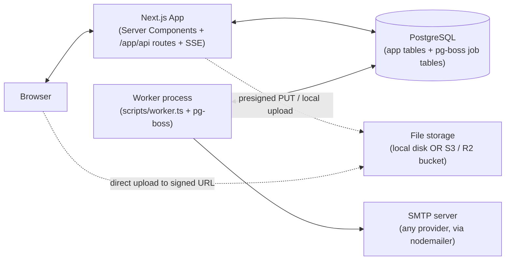
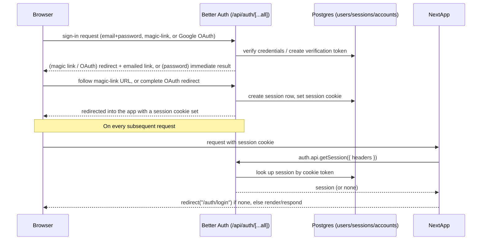
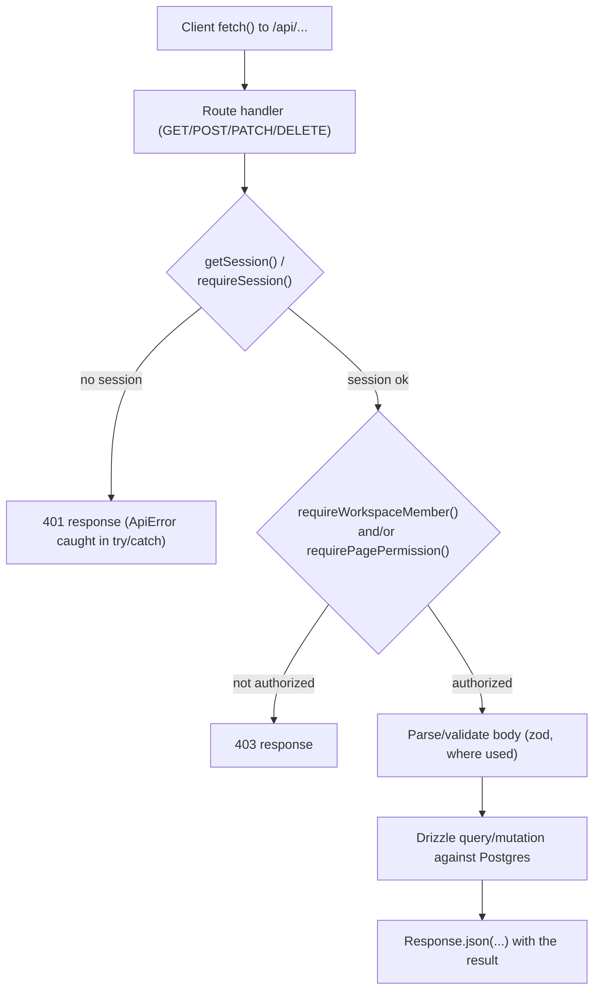

# Pagevo — Project Audit

This document describes the current state of the codebase on the `main` branch, as reverse-engineered directly from the source. It is a factual description only — it does not evaluate, rate, or recommend changes to what exists.

---

## 1. Project Overview

### Project purpose

Pagevo ("PAGEVO" in product copy) is a self-hosted, opinionated team workspace application, described in its own documentation as **"Notion's core, pre-assembled."** Everything in the product is modeled as a **page**; pages nest without limit; a database is a special kind of page where every row ("entry") is itself a full page with its own blocks and properties.

### What problem it solves

Per `doc/README.md`, the product targets teams who find general-purpose workspace tools (like Notion) powerful but overwhelming to configure. Instead of a blank, fully configurable canvas, Pagevo ships with a fixed, opinionated feature set — a block editor, a page hierarchy, databases, comments, notifications, search, templates, and permissions — intended to be usable immediately without a setup phase.

### Target users

Per the same documentation: small teams of roughly 3–15 people who want a structured shared wiki and lightweight project tracking, explicitly **not** targeting power users who want formulas, rollups, or heavy customization/automation.

### Current implementation status

The codebase is a fully implemented Next.js application, not a specification or prototype:

- 42 distinct page routes under `app/` (workspace app, settings, Orbit Admin, auth, invites, public sharing, marketing pages).
- 101 API route files under `app/api/`, together exporting roughly 140+ individual HTTP method handlers.
- 31 Postgres tables across 9 schema files (`lib/db/schema/`), managed with Drizzle ORM and versioned migrations under `drizzle/`.
- A second long-running process (`scripts/worker.ts`, started via `pnpm worker`) running `pg-boss` for background jobs, with 18 named job handlers and multiple scheduled cron jobs already registered.
- A working authentication system (Better Auth: email/password, magic link, Google OAuth), a two-layer permission model (workspace role + explicit/inherited page permissions), file upload support (S3/R2 or local-disk driver), an in-app + email notification system, and a Postgres full-text search index.
- A separate "Orbit Admin" platform-operator area (`/orbit-admin`), gated by an `is_platform_admin` user flag rather than workspace membership.

One discrepancy worth noting factually: `doc/README.md` opens with the line *"Status: pre-development — this repository is a design and architecture specification. No application code exists yet."* That statement does not match the state of the codebase itself, which is an extensively implemented application as described above; `doc/README.md` appears to not have been updated since a very early point in the project's history.

---

## 2. Technology Stack

Versions below are taken directly from `package.json` on `main`.

**Framework**
- Next.js `16.2.9` (App Router, `output: "standalone"`, Turbopack dev server)
- React `^19.2.7` / React DOM `^19.2.7`

**Language**
- TypeScript `^6.0.3` (strict mode; see `tsconfig.json`)
- Biome (`@biomejs/biome` `2.5.0`) as the linter/formatter (`pnpm lint`, `pnpm lint:fix`, `pnpm format`) — no ESLint/Prettier in use
- `ultracite` `7.8.3` (Biome preset/config package) present as a dev dependency

**Database**
- PostgreSQL, accessed via `drizzle-orm` `^0.45.2` and `postgres` (`^3.4.9`, the `postgres.js` driver)
- `drizzle-kit` `^0.31.10` for migration generation/push (`drizzle.config.ts`, `drizzle/` migration folder with a `meta/` journal)
- `embedded-postgres` `18.4.0-beta.17` (dev dependency) — used by `scripts/dev-db.ts` for a local Postgres instance without a separate install

**Authentication**
- `better-auth` `^1.6.18`, with its `admin` and `magic-link` plugins enabled (`lib/auth/index.ts`)
- Auth methods: email + password, magic link (passwordless), Google OAuth — each independently toggleable at runtime via a DB-backed `auth_settings` singleton row, enforced in a Better Auth `hooks.before` middleware, not just hidden in the UI

**UI library**
- Tailwind CSS `^4.3.1` (via `@tailwindcss/postcss`), plus `tailwind-merge` and `tw-animate-css`
- `radix-ui` `^1.5.0` (unstyled primitives) combined with local `components/ui/*` wrappers (a shadcn-style setup; `shadcn` `^4.11.0` and `components.json` are present)
- `lucide-react` `^1.21.0` — the sole icon library in use
- `@phosphor-icons/react` `^2.1.10` is also a dependency (present alongside lucide-react)
- `@dnd-kit/core` / `@dnd-kit/sortable` / `@dnd-kit/utilities` for drag-and-drop (sidebar reordering, Kanban board, etc.)
- `sonner` for toasts, `vaul` for drawers, `cmdk` for command-menu style UI, `react-resizable-panels`, `react-day-picker`

**Editor**
- TipTap (`@tiptap/react` `^3.26.1` and a large set of `@tiptap/extension-*` packages) on top of ProseMirror (`@tiptap/pm`) — the block-based rich text editor
- `lowlight` for code-block syntax highlighting, `katex` `^0.17.0` + `@tiptap/extension-mathematics` for LaTeX equation rendering

**Storage**
- Pluggable storage driver selected by the `STORAGE_DRIVER` env var (`lib/storage/index.ts`):
  - `local` (default) — files under a local `UPLOAD_DIR`, served via an API route
  - `s3` / `r2` — direct-to-bucket presigned PUT URLs via `@aws-sdk/client-s3` `^3.1070.0` and `@aws-sdk/s3-request-presigner`

**APIs**
- All first-party APIs are Next.js App Router route handlers under `app/api/**/route.ts` (REST-style JSON, no GraphQL layer)
- `zod` `^4.4.3` is used across many (though not all) route handlers and Better Auth config for input validation

**Third-party services**
- Google OAuth (`socialProviders.google` in `lib/auth/index.ts`, gated behind `GOOGLE_CLIENT_ID`/`GOOGLE_CLIENT_SECRET`)
- SMTP email delivery via `nodemailer` `^8.0.11` (`lib/smtp/client.ts`) — provider-agnostic (any SMTP host); falls back to console-logging the email content (and any embedded link) when SMTP isn't configured
- `cheerio` `^1.2.0` — used server-side to scrape Open Graph metadata for the link-preview endpoint (bookmark blocks)
- `react-email` / `@react-email/render` — used to render the HTML email templates under `lib/email/`

**Deployment-related tools**
- `Dockerfile` and `Dockerfile.worker` (separate images for the Next.js app and the pg-boss worker process)
- `docker-compose.yml` and `docker-compose.external-db.yml` for local/self-hosted orchestration (Postgres, app, worker, and an optional MinIO profile for S3-compatible local storage)
- `pnpm` (`packageManager: "pnpm@11.6.0"`) as the package manager, in a `pnpm-workspace.yaml`-declared workspace
- `concurrently` — runs the Next.js dev server and the worker together under `pnpm dev`

---

## 3. Application Architecture

### High-level architecture

Two long-running processes share one Postgres database:

1. **Next.js application** (`app/`) — serves both the web UI (Server + Client Components) and the JSON API (`app/api/**/route.ts`), and also serves realtime notification updates over Server-Sent Events (SSE) from within the same process.
2. **Worker process** (`scripts/worker.ts` → `lib/jobs/boss.ts`) — a separate Node process running `pg-boss`, which polls the same Postgres database for queued jobs and scheduled (cron) jobs. It is started independently (`pnpm worker`) and has its own Dockerfile (`Dockerfile.worker`).

There is no separate cache layer, message broker, or search service — job queuing, the search index, and application data all live in the one Postgres database.



### Folder structure

Annotated top-level layout (from the `main` branch):

```text
app/                  Next.js App Router — pages and API routes
  api/                 REST-style JSON API route handlers (101 route.ts files)
  app/                 The authenticated product itself: [workspace]/... routes
  auth/                Login, forgot-password, reset-password pages
  orbit-admin/         Platform-operator admin area (separate layout/guard)
  invite/, p/          Workspace/guest invite acceptance, public page viewer
  platform/            Post-signup onboarding + "where do I land" redirect logic
  privacy/, terms/     Static marketing/legal pages
  page.tsx             Root marketing/landing page
components/            React components, organized by feature area
  ui/                  Design-system primitives (Button, Dialog, Avatar, Select, ...)
  sidebar/, pages/,     Feature-specific component groups matching the domain
  database/, editor/,   (editor, database views, comments, notifications, ...)
  settings/, orbit/,
  templates/, notifications/, admin/
lib/                   Server-side and shared logic, no React
  db/                  Drizzle schema (schema/*.ts) + client setup
  auth/                Better Auth config and instance-wide auth-method settings
  authz.ts             requireSession()/requireAdmin() helpers for pages
  workspaces/auth.ts   requireWorkspaceMember()/getSession() helpers for API routes
  permissions/         Page-level effective-permission resolver
  pages/               Page hierarchy (closure table) maintenance helpers
  jobs/                pg-boss job names, registration, enqueue helper, handlers/
  notifications/       Notification trigger functions, SSE stream hook
  storage/              Storage driver abstraction (local/s3) + upload size/mime limits
  email/, smtp/          Email templates (react-email) and SMTP sending
  search/                Search index maintenance
  orbit/                 Platform audit log, instance setup-status helpers
  formula/, templates/   Database formula evaluation, template instantiation
worker/ (via scripts/)  Worker process entry point (scripts/worker.ts)
drizzle/                Generated SQL migrations + snapshot metadata
config/                 Small app-wide constants (product name, admin role, ...)
doc/, docs/             Product/engineering documentation
```

### Request flow

A typical authenticated page load, e.g. opening a page at `/app/[workspace]/[pageId]`:

1. Next.js resolves the route to `app/app/[workspace]/[pageId]/page.tsx`, a Server Component.
2. The nearest `layout.tsx` ancestors run first: `app/app/layout.tsx` calls `requireSession()` (redirects to `/auth/login` if there's no session), and `app/app/[workspace]/layout.tsx` loads the sidebar's page tree data for that workspace.
3. The page component itself calls `requireSession()` again, looks up the workspace by slug, calls `getWorkspaceMember()` to confirm the user belongs to that workspace, then queries the `pages` table (plus `page_closure` for the breadcrumb ancestor chain) for the requested page.
4. For a `database`-kind page, additional queries fetch `database_properties`, `database_views`, and entry rows (also `pages`, `kind = 'entry'`) plus their `property_values`.
5. The Server Component renders the resulting HTML/RSC payload; interactive pieces (the editor, comment threads, the sidebar) are Client Components that hydrate in the browser and then call `app/api/**` routes for any further reads/writes (e.g. autosaving block edits, adding a comment).

### Authentication flow



Server Components call `requireSession()` (`lib/authz.ts`), which redirects to `/auth/login` if there's no session. API route handlers instead call `getSession()` (`lib/workspaces/auth.ts`), which throws a typed `ApiError(401, ...)` that every route's `catch` block turns into a `401` JSON response — pages redirect, APIs return an error payload, by design.

Instance-wide, which of the three sign-in methods are actually offered is a single DB-backed toggle row (`auth_settings`, singleton `id = 1`), enforced inside a Better Auth `hooks.before` middleware (`lib/auth/index.ts`) for the relevant Better Auth paths (`/sign-up/email`, `/sign-in/email`, `/sign-in/magic-link`, `/sign-in/social` with `provider: "google"`) — so disabling a method server-side actually blocks the endpoint, not just hides a UI button.

### Database flow

- `drizzle-orm`'s `postgres` driver connects via `DATABASE_URL` (validated in `lib/env.ts`).
- Schema is split by domain under `lib/db/schema/` (`auth.ts`, `workspace.ts`, `pages.ts`, `databases.ts`, `collaboration.ts`, `sharing.ts`, `files.ts`, `platform.ts`, `search.ts`, `templates.ts`, `user-state.ts`), with shared enum definitions centralized in `lib/db/schema/types.ts`.
- Migrations are generated with `drizzle-kit generate` from the schema files into `drizzle/*.sql`, with a `drizzle/meta/` snapshot journal; applied with `tsx scripts/migrate.ts` (`pnpm db:migrate`).
- Queries throughout the codebase are built with Drizzle's query builder (`db.select()/.insert()/.update()/.delete()` with `and()/eq()/...` conditions); a small number of call sites (15 files) use Drizzle's tagged `sql\`...\`` template for expressions the query builder doesn't cover directly (e.g. `to_tsvector(...)`, increment expressions, `NOT EXISTS` subqueries) — all such usages interpolate values through the tag's own parameter binding (`${value}`), not string concatenation.
- Page hierarchy is maintained via a **closure table** (`page_closure`: `ancestor_id`, `descendant_id`, `depth`) alongside `pages.parent_id`, kept in sync by helpers in `lib/pages/closure.ts` whenever a page is created or moved.

### API flow

The common shape of an `app/api/**/route.ts` handler:



Concretely, most handlers follow this pattern (seen consistently across `app/api/pages/*`, `app/api/databases/*`, `app/api/workspaces/*`, etc.): call `getSession()`, load the relevant `workspaceId` from the target row, call `requireWorkspaceMember(workspaceId, userId, minRole?)` (workspace-role check) and/or `requirePagePermission(userId, pageId, minLevel)` (page-level check), then perform the Drizzle operation, with a top-level `try { ... } catch (err) { if (err instanceof ApiError) return apiError(err.status, err.message); ... }` wrapper turning thrown `ApiError`s into the corresponding HTTP status.

### Database flow (permissions specifically)

`lib/permissions/resolver.ts`'s `getEffectivePermission()` computes a user's access level on a given page by:
1. Checking if the page is private — if so, only its creator or an explicit `page_permissions` grant apply (workspace Admins get no automatic access to a private page they don't own).
2. Otherwise, workspace Admins get `full_access` automatically.
3. Otherwise, look for an explicit `page_permissions` row for that exact page.
4. Otherwise, walk the `parent_id` chain (via a recursive CTE) for the nearest ancestor with an explicit grant.
5. Otherwise, fall back to a role-based default (`editor` → `can_edit`, `viewer` → `can_view`).

Every resolved level is capped by the user's workspace role ceiling (a Viewer can never end up above `can_view`, even via an explicit grant).

### Major modules and how they interact

- **Pages module** (`lib/pages/`, `lib/db/schema/pages.ts`) is the structural backbone — workspaces, databases, and database entries are all rows in the same `pages` table, distinguished by a `kind` enum (`page` / `database` / `entry`).
- **Permissions module** (`lib/permissions/`, `lib/workspaces/auth.ts`) is consulted by nearly every other module (pages, comments, sharing, blocks) before a read or write is allowed.
- **Blocks/editor** (`lib/db/schema/pages.ts`'s `blocks` table, `components/editor/`) stores page content as ordered block rows with JSONB `content` and an explicit `schema_version` per block.
- **Databases module** (`lib/db/schema/databases.ts`, `components/database/`) layers typed properties, per-entry values, and multiple named views (table/board/calendar/gallery) on top of the same page/entry structure.
- **Notifications module** (`lib/notifications/triggers.ts`, `lib/db/schema/collaboration.ts`) is written to from other modules (comments, sharing, trash) inside the same transaction as the triggering event, and read both via a REST endpoint and an SSE stream for realtime delivery.
- **Jobs module** (`lib/jobs/`) is the single integration point for anything slow, retryable, or scheduled (email delivery, trash/version expiry, storage accounting, invite expiry) — invoked via `enqueueJob()` from request-handling code, executed later by the separate worker process.
- **Orbit Admin module** (`app/orbit-admin/`, `lib/orbit/`) sits alongside the rest of the app with its own layout/guard (`requireAdmin()`), reading the same schema tables platform-wide (across all workspaces) rather than scoped to one workspace.

---

## 4. Pages & Screens

42 page routes exist under `app/`. Access-control notes cite the actual check found in the page or its layout.

### Marketing / public

#### `/` — root landing page
- **Purpose:** Public marketing/landing page (product pitch, feature highlights).
- **Who can access it:** Anyone (no auth check); redirects an already-signed-in user onward (checked via `getCurrentSession()`).
- **Features:** Static marketing sections, mobile nav, scroll-reveal animations; links into `/auth/login` and `/app/workspaces/new`.
- **APIs used:** None (fully server-rendered, no client fetches).

#### `/privacy` — Privacy Policy
- **Purpose:** Static privacy policy content.
- **Who can access it:** Anyone.
- **Features:** Read-only sectioned policy text.
- **APIs used:** None.

#### `/terms` — Terms of Service
- **Purpose:** Static terms-of-service content.
- **Who can access it:** Anyone.
- **Features:** Read-only sectioned terms text.
- **APIs used:** None.

### Authentication

#### `/auth/login` — Sign in
- **Purpose:** Renders the sign-in form (`AuthForm`), supporting whichever methods are enabled.
- **Who can access it:** Anyone (unauthenticated).
- **Features:** Email+password sign-in/sign-up, magic-link request, Google OAuth button — shown/hidden based on `GET /api/auth/methods`.
- **APIs used:** `GET /api/auth/methods`, Better Auth's own `/api/auth/[...all]` endpoints (sign-in/sign-up/magic-link/social).

#### `/auth/forgot-password` — Request password reset
- **Purpose:** Collects an email and triggers Better Auth's password-reset email flow.
- **Who can access it:** Anyone.
- **Features:** Email form, success/error state.
- **APIs used:** Better Auth `requestPasswordReset` client call (routes through `/api/auth/[...all]`).

#### `/auth/reset-password` — Set new password
- **Purpose:** Consumes a reset token (`?token=`) and sets a new password.
- **Who can access it:** Anyone holding a valid, unexpired reset token.
- **Features:** New-password form with validation/error states; invalid/expired-token state.
- **APIs used:** Better Auth `resetPassword` client call.

### Invitations & public sharing

#### `/invite/[token]` — Workspace invite acceptance
- **Purpose:** Looks up a `workspace_members` row by `inviteToken` and lets the invitee accept (or set a password, if they have no existing sign-in method).
- **Who can access it:** Anyone holding the token URL; behavior branches if the currently-signed-in account doesn't match the invited email ("wrong account" state).
- **Features:** Accept-and-join flow, set-password-then-join flow, workspace name/icon preview.
- **APIs used:** `POST /api/invite/[token]/accept`, `POST /api/invite/[token]/set-password`.

#### `/invite/guest/[token]` — Guest (page-level) invite acceptance
- **Purpose:** Accepts a page-scoped guest invitation (not a full workspace membership).
- **Who can access it:** Anyone holding the token URL.
- **Features:** Shows the invited page's title/icon and the granted access level; accept action.
- **APIs used:** `GET /api/invite/guest/[token]`, `POST /api/invite/guest/[token]`.

#### `/p/[token]` — Public page viewer
- **Purpose:** Renders a page shared via a public link, read-only or read+comment depending on the link's access level.
- **Who can access it:** Anyone with the link, provided the `public_links` row is `isActive`.
- **Features:** Read-only (or commentable) rendering of the page's blocks, no workspace chrome (sidebar/topbar).
- **APIs used:** None observed beyond the initial server-rendered load (viewer component renders pre-fetched blocks).

### Platform (post-signup routing)

#### `/platform/onboarding` — New-user onboarding wizard
- **Purpose:** Collects profile info and walks a brand-new user through initial setup; skipped (redirects to `/platform/post-auth`) if already completed.
- **Who can access it:** Any authenticated user (`requireSession()`) who hasn't completed onboarding.
- **Features:** Multi-step onboarding UI (`OnboardingUI`), aware of whether SMTP is configured (affects invite-teammates copy).
- **APIs used:** Onboarding-related API routes (`/api/onboarding/*`) and workspace-creation actions.

#### `/platform/post-auth` — Post-authentication router
- **Purpose:** Decides where a freshly-authenticated user lands: auto-accepts a pending invite if it's their very first membership anywhere, otherwise routes to their last/first active workspace or workspace creation.
- **Who can access it:** Any authenticated user.
- **Features:** No visible UI in the common case — pure server-side redirect logic; writes a platform audit-log entry.
- **APIs used:** None (direct DB reads/writes in the Server Component).

### Workspace creation / setup

#### `/app/workspaces/new` — Create a workspace
- **Purpose:** Form to create a new workspace (personal or team).
- **Who can access it:** Any authenticated user.
- **Features:** Name/icon input, personal-vs-team copy variant (`?kind=team`).
- **APIs used:** `createWorkspaceAction` server action (not a REST route).

#### `/app/workspaces/setup/[slug]` — First-run workspace setup
- **Purpose:** Post-creation setup screen for a workspace the user just created or joined (only reachable if they're an active member of that workspace).
- **Who can access it:** Active members of that specific workspace only (`notFound()` otherwise).
- **Features:** `WorkspaceSetup` component — likely template/starting-page selection (see Features section).
- **APIs used:** Workspace/template creation routes invoked by `WorkspaceSetup`.

### Workspace app — core

#### `/app/[workspace]` — Workspace Home
- **Purpose:** Dashboard-style landing page for a workspace: greeting, page/member/starred stats, quick actions, "Jump back in" (recently visited), favorites, "All Pages", and first-time onboarding checklist.
- **Who can access it:** Active members of the workspace (`getWorkspaceMember`).
- **Features:** Quick "New page" / Library / Templates / Settings / Invite-members tiles, recently-visited tile row, favorites section, onboarding checklist (visible while `pageCount <= 1`).
- **APIs used:** Mutations from child client components (`NewPageButton`, favorites toggling, etc.) hit `/api/pages`, `/api/user/favorites/*`; the page itself is server-rendered from direct DB queries.

#### `/app/[workspace]/[pageId]` — Page editor
- **Purpose:** The main page-viewing/editing surface; branches internally to a distinct rendering path for `kind: "database"` pages (via `TemplatePageClient`) versus regular pages (via `PageClient`).
- **Who can access it:** Gated by `requireSession()` + workspace membership; further gated by the page-level permission resolver for private pages (an editor-only action bar, e.g. `PageActionsMenu`, additionally requires `isEditor`).
- **Features:** Breadcrumbs, page icon/cover, block editor, comments, share/favorite/lock/duplicate/export/version-history/delete actions, a `TrashBanner` (restore / delete forever) when the page is soft-deleted, a privacy pill/toggle.
- **APIs used:** `GET/PATCH/DELETE /api/pages/[id]`, `/api/pages/[id]/blocks`, `/api/pages/[id]/comments`, `/api/pages/[id]/duplicate`, `/api/pages/[id]/export`, `/api/pages/[id]/lock`, `/api/pages/[id]/move`, `/api/pages/[id]/permissions`, `/api/pages/[id]/public-link`, `/api/pages/[id]/restore`, `/api/pages/[id]/versions*`, `/api/pages/[id]/guests/*`.

#### `/app/[workspace]/[pageId]/history` — Page version history
- **Purpose:** Side-panel-style page listing auto-saved version snapshots for a page, with preview/restore.
- **Who can access it:** Same workspace-membership gate as the page editor.
- **Features:** Version list, preview a version, "Restore this version."
- **APIs used:** `GET /api/pages/[id]/versions`, `POST /api/pages/[id]/versions/[versionId]/restore`.

#### `/app/[workspace]/t/[pageId]` — Template/database preview route
- **Purpose:** A second entry point into a `database`-kind page (also rendered via `TemplatePageClient`) — the `/t/` path appears to serve the "preview a database/template" case distinctly from the main `/app/[workspace]/[pageId]` route.
- **Who can access it:** Same workspace-membership gate.
- **Features:** Same database view (table/board/calendar/gallery) rendering as the main database page route.
- **APIs used:** Same database/entry API surface as `/api/databases/[id]/*` and `/api/entries/[id]/*`.

#### `/app/[workspace]/new` — New blank page (redirect endpoint)
- **Purpose:** Creates a new page (optionally under a `?parent=` page) and redirects into its editor; not a rendered screen itself.
- **Who can access it:** Active workspace members with `editor` role or above (`viewer` is redirected back to workspace home without creating anything).
- **Features:** None (no UI — a server-side create-then-redirect action).
- **APIs used:** None (direct DB insert via `insertPageWithClosure`, not a REST call).

#### `/app/[workspace]/new-database` — New database (redirect endpoint)
- **Purpose:** Same pattern as `/new`, but creates a `kind: "database"` page (with a default view) and redirects into it.
- **Who can access it:** Active workspace members with `editor` role or above.
- **Features:** None (create-then-redirect).
- **APIs used:** None (direct DB insert via `createPageWithClosure`).

#### `/app/[workspace]/library` — Library
- **Purpose:** Full listing of every page in the workspace (as opposed to Home's curated subset).
- **Who can access it:** Active workspace members.
- **Features:** Full page table/list, likely sortable/filterable given its Client Component (`LibraryClient`); row-level actions (via `PageActionsMenu`, delete rows disappear locally rather than redirecting).
- **APIs used:** `/api/pages/[id]` (delete, from row actions), page-tree/listing endpoints consumed by `LibraryClient`.

#### `/app/[workspace]/templates` — Templates gallery
- **Purpose:** Browse built-in and workspace-custom templates, and start a new page from one.
- **Who can access it:** Active workspace members (an `isPlatformAdmin` flag is also fetched, likely to surface admin-only affordances in the gallery).
- **Features:** Category filtering, template preview, "Use template."
- **APIs used:** `GET /api/templates`, `GET /api/templates/categories`, `POST /api/templates/[id]/use`, `GET/POST /api/workspaces/[id]/templates`.

#### `/app/[workspace]/search` — Search (modal trigger)
- **Purpose:** Not a real page — its entire body just dispatches a `pagevo:open-search` custom event and renders nothing, so navigating here opens the global search modal (mounted once in the workspace layout) instead of showing dedicated page content.
- **Who can access it:** Same as any workspace route (session + membership, enforced by the ancestor layouts).
- **Features:** None directly — delegates to the Search dialog.
- **APIs used:** `GET /api/search` (triggered from within the search modal, not this route itself).

#### `/app/[workspace]/trash` — Trash
- **Purpose:** Lists soft-deleted pages for the workspace with restore / permanently-delete / empty-trash actions.
- **Who can access it:** Active workspace members.
- **Features:** Trashed-page list with deletion timestamps, restore, delete-forever, and (per docs) an "Empty Trash" bulk action scoped to what the current user is permitted to delete.
- **APIs used:** `POST /api/pages/[id]/restore`, `DELETE /api/pages/[id]`.

### Settings

#### `/app/[workspace]/settings` — Settings index
- **Purpose:** Redirect-only route; immediately redirects to `.../settings/profile`.
- **Who can access it:** Any authenticated user hitting this path.
- **Features:** None (redirect).
- **APIs used:** None.

#### `/app/[workspace]/settings/profile` — My Profile
- **Purpose:** Edit personal profile fields (name, job title, timezone, avatar) and account-level actions (per `ProfileSection`).
- **Who can access it:** Any authenticated user (workspace-agnostic — reads `session.user`, not workspace membership).
- **Features:** Profile field editing (auto-save on blur, per product docs), avatar upload, account deletion entry point.
- **APIs used:** `PATCH /api/user/profile`, `POST /api/uploads/sign` (avatar upload), `DELETE /api/user/account`.

#### `/app/[workspace]/settings/sessions` — Sessions & security
- **Purpose:** Lists the user's active sessions across devices with revoke controls.
- **Who can access it:** Any authenticated user.
- **Features:** Per-session device/IP/last-active display, "current session" badge, revoke individual/all-other sessions.
- **APIs used:** Better Auth session-revocation endpoints (via `/api/auth/[...all]`).

#### `/app/[workspace]/settings/notifications` — Notification preferences
- **Purpose:** Configure email notification frequency and per-category opt-outs.
- **Who can access it:** Any authenticated user.
- **Features:** Real-time/Daily/Weekly/Off frequency picker, weekly-digest day picker, per-event-type toggles (mentions, page updates, workspace invites, task assignments).
- **APIs used:** `GET/PATCH /api/user/notification-preferences`.

#### `/app/[workspace]/settings/general` — Workspace general settings
- **Purpose:** Edit workspace-level settings (name, icon, slug, default page access).
- **Who can access it:** Gated by workspace membership at the page level; the underlying settings component further restricts write actions to Admins.
- **Features:** Workspace identity fields, default-access toggle, (per docs) danger-zone actions (transfer ownership, delete workspace).
- **APIs used:** `GET/PATCH/DELETE /api/workspaces/[id]`, `POST /api/workspaces/[id]/transfer*`.

#### `/app/[workspace]/settings/members` — Workspace members
- **Purpose:** Manage workspace membership: invite, change roles, remove members, manage the invite link and pending invitations.
- **Who can access it:** Gated by workspace membership at the page level; member-management actions are Admin-only per the underlying API routes.
- **Features:** Member list with role dropdowns, invite-by-email, shareable invite link (copy/disable/regenerate), pending-invite resend/cancel.
- **APIs used:** `GET/POST /api/workspaces/[id]/members`, `PATCH/DELETE /api/workspaces/[id]/members/[userId]`, `GET/POST/DELETE /api/workspaces/[id]/invite-link`, `POST /api/workspaces/[id]/invitations/[inviteId]/resend`, `DELETE /api/workspaces/[id]/invitations/[inviteId]`.

### Orbit Admin (platform operator area — `/orbit-admin/orbit/*`)

All routes below are wrapped by `app/orbit-admin/layout.tsx`, which calls `requireAdmin()` (`lib/authz.ts`) — redirects to `/dashboard` unless the signed-in user's `role === "admin"` (and isn't banned). This is a platform-wide flag, unrelated to any workspace's membership roles.

#### `/orbit-admin/orbit` — Orbit Overview
- **Purpose:** Platform-wide dashboard: user/workspace/session counts, signups, a setup checklist.
- **Features:** Metric tiles, recent activity, `getInstanceSetupStatus()`-driven setup checklist.
- **APIs used:** Server-rendered directly from DB queries; no client-side API calls observed on this route itself.

#### `/orbit-admin/orbit/analytics` — Analytics
- **Purpose:** Aggregated, anonymized usage metrics (signups over time, notification/email volume, search usage).
- **Features:** Time-series groupings (`groupByDay`) rendered as charts/tables.
- **APIs used:** Server-rendered from DB queries directly.

#### `/orbit-admin/orbit/audit` — Audit Trail
- **Purpose:** Paginated, read-only listing of `platform_audit_log` entries.
- **Features:** Action-type pill, actor, target, pagination (`PaginationControls`, page size 25).
- **APIs used:** Server-rendered; pagination via `searchParams`.

#### `/orbit-admin/orbit/email` — Email outbox
- **Purpose:** Lists queued/sent/failed emails from `email_outbox` with retry.
- **Features:** Status per email, retry button, pagination (page size 10).
- **APIs used:** `POST /api/orbit/email/[id]/retry`.

#### `/orbit-admin/orbit/queues` — Background job queues
- **Purpose:** Shows pg-boss queue/job state summaries.
- **Features:** Per-state counts and coloring (completed/active/retry/failed/etc.).
- **APIs used:** Server-rendered via `getQueueSummary()` (`lib/jobs/queue-inspection.ts`), not a client API call.

#### `/orbit-admin/orbit/settings` — Instance auth settings
- **Purpose:** Toggle which sign-in methods (email+password, magic link, Google) are enabled instance-wide.
- **Features:** Per-method switches; shows whether Google is actually configured (`googleConfigured`).
- **APIs used:** `GET/PATCH /api/orbit/auth-settings`.

#### `/orbit-admin/orbit/users` — User management (list)
- **Purpose:** Paginated, searchable list of all registered users.
- **Features:** Name/email search, pagination (page size 25).
- **APIs used:** Server-rendered directly from DB; search via `searchParams`.

#### `/orbit-admin/orbit/users/[id]` — User detail
- **Purpose:** Single-user detail view: profile, workspaces, sessions, account status/actions.
- **Features:** Ban/unban, impersonate, revoke sessions, session list with pagination.
- **APIs used:** `POST /api/orbit/users/[id]/ban`, `POST /api/orbit/users/[id]/unban`, `POST /api/orbit/users/[id]/impersonate`, `POST /api/orbit/users/[id]/revoke-sessions`.

#### `/orbit-admin/orbit/workspaces` — Workspace management (list)
- **Purpose:** Paginated, searchable list of all workspaces.
- **Features:** Name/ID search, pagination (page size 24).
- **APIs used:** Server-rendered directly from DB.

#### `/orbit-admin/orbit/workspaces/[id]` — Workspace detail
- **Purpose:** Single-workspace detail: members, page count, storage usage, force-delete.
- **Features:** Storage-quota display (5 GB), force-delete action (irreversible).
- **APIs used:** `DELETE /api/orbit/workspaces/[id]`.

#### `/orbit-admin/orbit/templates` — Built-in/custom template management (list)
- **Purpose:** List all templates (built-in and workspace-custom) with publish state.
- **Features:** Publish/unpublish toggle, preview modal, delete, seed built-ins button.
- **APIs used:** `GET /api/orbit/templates`, `POST /api/orbit/templates/seed`, `PATCH /api/orbit/templates/[id]/publish`, `PATCH /api/orbit/templates/[id]/unpublish`, `DELETE /api/orbit/templates/[id]`.

#### `/orbit-admin/orbit/templates/new` — New template
- **Purpose:** Block-based form to author a new built-in template.
- **Features:** `TemplateForm` (name/description/category/content).
- **APIs used:** `POST /api/orbit/templates`, `GET/POST /api/orbit/templates/categories`.

#### `/orbit-admin/orbit/templates/[id]/edit` — Edit template
- **Purpose:** Edit an existing template's metadata/content.
- **Features:** Same `TemplateForm`, pre-filled.
- **APIs used:** `PATCH /api/orbit/templates/[id]`.

---

## 5. Features

### Authentication
- **Description:** Sign-in via email+password, magic link, or Google OAuth, each independently toggleable instance-wide.
- **User flow:** User visits `/auth/login` → picks an available method → (password) submits credentials directly; (magic link) enters email, receives a one-time link, clicking it signs them in; (Google) redirected through Google's OAuth consent screen back into the app.
- **Related pages:** `/auth/login`, `/auth/forgot-password`, `/auth/reset-password`.
- **Related APIs:** `/api/auth/[...all]` (Better Auth's own handler), `/api/auth/methods`.
- **Database tables:** `users`, `sessions`, `accounts`, `verifications`, `auth_settings`.

### Sessions & device management
- **Description:** Users can view and revoke their own active sessions across devices.
- **User flow:** Settings → Sessions → see a list of sessions (device/IP/last-active) → revoke one or all-but-current.
- **Related pages:** `/app/[workspace]/settings/sessions`.
- **Related APIs:** Better Auth session endpoints via `/api/auth/[...all]`; `GET /api/account/export` includes session history in a personal data export.
- **Database tables:** `sessions`.

### Workspaces
- **Description:** Top-level container a user's pages/members/settings live under; a user can belong to multiple workspaces.
- **User flow:** Create a workspace (`/app/workspaces/new`) or accept an invite (`/invite/[token]`) → land inside it at `/app/[workspace]`.
- **Related pages:** `/app/workspaces/new`, `/app/workspaces/setup/[slug]`, `/app/[workspace]/settings/general`.
- **Related APIs:** `POST /api/workspaces`, `GET/PATCH/DELETE /api/workspaces/[id]`, `POST /api/workspaces/[id]/transfer`, `GET /api/workspaces/[id]/transfer/confirm`.
- **Database tables:** `workspaces`, `workspace_slug_redirects`, `workspace_members`.

### Workspace membership & invitations
- **Description:** Invite members by email or shareable link; manage roles (Admin/Editor/Viewer); remove members.
- **User flow:** Settings → Members → invite by email or copy the invite link → invitee accepts at `/invite/[token]` → appears in the member list with their role.
- **Related pages:** `/app/[workspace]/settings/members`.
- **Related APIs:** `GET/POST /api/workspaces/[id]/members`, `PATCH/DELETE /api/workspaces/[id]/members/[userId]`, `GET/POST/DELETE /api/workspaces/[id]/invite-link`, `POST /api/workspaces/[id]/invitations/[inviteId]/resend`, `DELETE /api/workspaces/[id]/invitations/[inviteId]`.
- **Database tables:** `workspace_members`.

### Onboarding
- **Description:** A guided first-run flow for brand-new users, plus a "where do I land" router for every subsequent login.
- **User flow:** First sign-in → `/platform/onboarding` (profile step) → workspace created/joined → `/platform/post-auth` decides the landing workspace, auto-accepting a pending invite if it's the user's very first membership.
- **Related pages:** `/platform/onboarding`, `/platform/post-auth`, `/app/workspaces/setup/[slug]`.
- **Related APIs:** `POST /api/onboarding/dismiss-hint`, `POST /api/onboarding/tour-complete`.
- **Database tables:** `users` (`onboarding_completed`, `onboarding_step`, `tour_completed`), `user_hint_states`.

### Pages
- **Description:** The universal content container — every page can nest unlimited subpages, and carries an icon, cover image, layout options, lock state, and privacy flag.
- **User flow:** Create via the sidebar `+`, a subpage hover-`+`, or `/app/[workspace]/new`; set icon/cover from the page header; use the "⋯" menu for move/duplicate/export/lock/delete.
- **Related pages:** `/app/[workspace]/[pageId]`, `/app/[workspace]/[pageId]/history`, `/app/[workspace]/library`, `/app/[workspace]/trash`.
- **Related APIs:** `GET/PATCH/DELETE /api/pages/[id]`, `POST /api/pages`, `POST /api/pages/[id]/duplicate`, `PATCH /api/pages/[id]/move`, `POST /api/pages/[id]/lock`, `POST /api/pages/[id]/export`, `GET /api/pages/[id]/ancestors`.
- **Database tables:** `pages`, `page_closure`.

### Page trash & version history
- **Description:** Soft-deleted pages are recoverable for a retention window; pages also keep auto-saved content snapshots that can be previewed/restored.
- **User flow:** Delete a page (moves to Trash) → Trash page shows it with restore/delete-forever actions; separately, a page's "⋯" → Version History shows timestamped snapshots with restore.
- **Related pages:** `/app/[workspace]/trash`, `/app/[workspace]/[pageId]/history`.
- **Related APIs:** `POST /api/pages/[id]/restore`, `DELETE /api/pages/[id]`, `GET /api/pages/[id]/versions`, `POST /api/pages/[id]/versions`, `POST /api/pages/[id]/versions/[versionId]/restore`.
- **Database tables:** `pages` (`is_deleted`, `deleted_at`, `deleted_by`, `trash_warning_sent`), `page_versions`.

### Block-based editor
- **Description:** TipTap/ProseMirror-powered editor; every piece of content is a typed block row.
- **User flow:** Type `/` for the slash-command menu, or use Markdown shortcuts; select text for the floating formatting toolbar; drag a block's handle to reorder/nest it.
- **Related pages:** `/app/[workspace]/[pageId]` (`PageClient`).
- **Related APIs:** `GET/POST /api/pages/[id]/blocks`, `PATCH/DELETE /api/blocks/[id]`, `POST /api/blocks/batch`, `GET /api/blocks/[id]/synced-content`.
- **Database tables:** `blocks` (typed via the `block_type` enum, JSONB `content`, explicit `schema_version`).

### Databases
- **Description:** Structured collections where each entry is a full page; supports Table, Board, Calendar, and Gallery views, each with independent filters/sorts/grouping.
- **User flow:** Create a database (`/app/[workspace]/new-database` or `/database` in the editor) → add properties/views → add entries via each view's "+ New" affordance → open an entry as a side-panel or full page (per the view's `entry_open_mode`).
- **Related pages:** `/app/[workspace]/[pageId]` (database branch), `/app/[workspace]/t/[pageId]`.
- **Related APIs:** `GET/POST /api/databases/[id]/entries`, `GET/POST /api/databases/[id]/views`, `PATCH/DELETE /api/databases/[id]/views/[viewId]`, `GET /api/databases/[id]`, `GET/POST /api/workspaces/[id]/databases`.
- **Database tables:** `pages` (`kind: 'database'` / `'entry'`, `database_id`), `database_views`.

### Database properties
- **Description:** Typed columns (Text, Number, Select, Multi-Select, Date, Checkbox, URL, Email, Phone, Person, Relation) with per-entry values.
- **User flow:** Click `+` in a table's column headers or "+ Add a property" in an entry → choose a type → configure; edit/rename/reorder/hide/delete from the column header menu.
- **Related pages:** Same database pages as above.
- **Related APIs:** `GET/POST /api/databases/[id]/properties`, `PATCH/DELETE /api/databases/[id]/properties/[propId]`, `PATCH /api/databases/[id]/properties/reorder`, `GET/PATCH /api/entries/[id]/property-values`, `PATCH /api/entries/[id]/property-values/[propId]`.
- **Database tables:** `database_properties`, `property_values`.

### Comments & mentions
- **Description:** Threaded comments at the block, text-selection, and page level; one level of reply nesting; resolve/reopen; emoji reactions; `@mention`/`@page`/`@date` references inside comment and page content.
- **User flow:** Hover a block or select text → comment icon → write a comment; scroll to page bottom for page-level comments; click a thread's checkmark to resolve.
- **Related pages:** `/app/[workspace]/[pageId]`.
- **Related APIs:** `GET/POST /api/pages/[id]/comments`, `PATCH/DELETE /api/pages/[id]/comments/[commentId]`, `PATCH/DELETE /api/comments/[id]`, `POST /api/comments/[id]/react`, `POST /api/comments/[id]/resolve`, `POST /api/comments/[id]/reopen`.
- **Database tables:** `comments`.

### Notifications (in-app + email)
- **Description:** Users are notified of mentions, replies, being granted page access, and trash-related events (page moved to Trash / nearing permanent deletion), both in-app and via email (real-time, daily digest, weekly digest, or off).
- **User flow:** Bell icon opens the notification panel → click a notification to navigate to its source → mark read/all-read/clear; separately, real-time toasts appear via SSE while the app is open; email delivery follows the user's configured frequency.
- **Related pages:** Notification panel/bell is part of the persistent sidebar chrome across `/app/[workspace]/*`; preferences at `/app/[workspace]/settings/notifications`.
- **Related APIs:** `GET /api/notifications`, `GET /api/notifications/stream` (SSE), `PATCH /api/notifications/[id]/read`, `PATCH /api/notifications/read-all`, `DELETE /api/notifications/[id]`, `POST /api/notifications/clear-all`, `GET/PATCH /api/user/notification-preferences`.
- **Database tables:** `notifications`, `notification_preferences`, `email_outbox`.

### Search
- **Description:** Postgres full-text search (`tsvector`/`tsquery`) across page titles/content/comments, permission-filtered, with type/location/date/title-only/author filters.
- **User flow:** `Ctrl/Cmd+K` (or the Search sidebar item) opens the search dialog → type a query → filtered, ranked results → open a result.
- **Related pages:** `/app/[workspace]/search` (modal trigger only).
- **Related APIs:** `GET /api/search`, `POST /api/search/reindex`.
- **Database tables:** `search_index`, `search_query_log`.

### Templates
- **Description:** A built-in template gallery (categorized) plus workspace-scoped custom templates; a "Template Button" block that inserts a predefined block structure on click.
- **User flow:** "+ New page" → "Browse templates" → pick a category/template → "Use template" instantiates its saved block structure as a new page; or "Save as template" from an existing page.
- **Related pages:** `/app/[workspace]/templates`, `/app/[workspace]/t/[pageId]`, Orbit's `/orbit-admin/orbit/templates*` (built-in template authoring).
- **Related APIs:** `GET /api/templates`, `GET /api/templates/categories`, `POST /api/templates/[id]/use`, `GET/POST /api/workspaces/[id]/templates`, `PATCH/DELETE /api/workspaces/[id]/templates/[templateId]`.
- **Database tables:** `templates`, `template_categories`.

### Permissions & sharing
- **Description:** Two-layer access model — workspace role (Admin/Editor/Viewer) plus optional page-level overrides (Full Access/Can Edit/Can Comment/Can View), inherited down the page hierarchy; public link sharing; page-scoped guest invitations for non-members.
- **User flow:** Share panel on a page → add a workspace member at a specific access level, or toggle "Share to web" for a public link, or invite an external guest by email.
- **Related pages:** `/app/[workspace]/[pageId]` (Share panel).
- **Related APIs:** `GET/POST/DELETE /api/pages/[id]/permissions`, `GET/POST/DELETE /api/pages/[id]/public-link`, `POST /api/pages/[id]/guests/invite`, `DELETE /api/pages/[id]/guests/[guestId]`.
- **Database tables:** `page_permissions`, `public_links`, `guest_invitations`.

### Private pages
- **Description:** A page can be flagged private, restricting access to its creator plus explicit grants — hidden entirely from the sidebar/search for everyone else, including workspace Admins.
- **User flow:** Toggle a page to Private from its privacy pill/menu.
- **Related pages:** `/app/[workspace]/[pageId]`.
- **Related APIs:** Covered by `/api/pages/[id]` (PATCH) and the permissions endpoints above.
- **Database tables:** `pages.is_private`.

### File storage / uploads
- **Description:** Direct-to-storage uploads (presigned S3/R2 PUT, or local-disk POST) for page covers/icons, user avatars, workspace icons, and in-editor media blocks, with per-kind size/MIME limits and a 5 GB per-workspace quota (avatars excluded).
- **User flow:** "Add cover"/icon picker/drag-drop a media block → client requests a signed upload slot → uploads directly to storage → confirms the upload.
- **Related pages:** Anywhere a cover/icon/avatar/media block is set (page editor, profile settings, workspace settings).
- **Related APIs:** `POST /api/uploads/sign`, `POST /api/uploads/confirm`, `POST /api/uploads/local`, `GET /api/uploads/files/[...path]`.
- **Database tables:** `file_uploads`, `workspace_storage_usage`.

### Favorites & recently visited
- **Description:** Per-user starred pages (reorderable) and an automatically maintained "last visited" list.
- **User flow:** Star icon on hover in the sidebar/page tree to favorite; visiting any page updates its position in "Recently Visited."
- **Related pages:** Sidebar chrome across `/app/[workspace]/*`.
- **Related APIs:** `GET/POST /api/user/favorites`, `DELETE /api/user/favorites/[pageId]`, `PATCH /api/user/favorites/reorder`, `GET/POST /api/user/recently-visited`.
- **Database tables:** `user_favorites`, `user_recently_visited`.

### Account settings & data export
- **Description:** Edit profile fields, timezone, and general preferences; export a personal data bundle (profile, sessions, linked accounts); delete an account (blocked if the user is the sole Admin of any workspace until ownership is transferred).
- **Related pages:** `/app/[workspace]/settings/profile`.
- **Related APIs:** `PATCH /api/user/profile`, `GET/PATCH /api/user/preferences`, `GET /api/account/export`, `DELETE /api/user/account`.
- **Database tables:** `users`, `user_preferences`.

### Orbit Admin (platform administration)
- **Description:** A separate, `is_platform_admin`-gated area for operating the whole instance: user/workspace management (ban, impersonate, revoke sessions, force-delete), instance auth-method toggles, built-in template authoring/publishing, background-job queue inspection, an append-only audit log, and aggregated analytics.
- **User flow:** A platform admin (auto-promoted on the very first account created on a fresh instance, or via `pnpm make:admin`) navigates to `/orbit-admin/orbit` and its subsections.
- **Related pages:** All `/orbit-admin/orbit/*` routes.
- **Related APIs:** `/api/orbit/*` (users, workspaces, templates, auth-settings, analytics, audit, email retry).
- **Database tables:** `platform_audit_log`, plus platform-wide reads of `users`, `workspaces`, `workspace_members`, `templates`, `template_categories`, `email_outbox`, `sessions`.

---

## 6. API Inventory

101 route files under `app/api/`, exporting the HTTP methods listed below. Auth column cites the actual check found in the handler. "Session only" means `getSession()`/`requireSession()` with no further workspace/page/role check in that handler.

### Auth (`/api/auth/*`)
| Route | Method | Purpose | Auth |
|---|---|---|---|
| `/api/auth/[...all]` | (catch-all) | Better Auth's own handler — sign-in/up, magic-link, OAuth callback, session, password reset, etc. | Handled internally by Better Auth |
| `/api/auth/methods` | GET | Reports which sign-in methods are enabled/configured, and whether this is a fresh ("bootstrap") instance | Public, no session required |

### Account & user (`/api/account/*`, `/api/user/*`)
| Route | Method | Purpose | Auth |
|---|---|---|---|
| `/api/account/export` | GET | Downloads a JSON export of the current user's profile, sessions, and linked accounts | Better Auth session (`auth.api.getSession`) |
| `/api/user/account` | DELETE | Deletes the current user's account (blocked if sole Admin of a workspace) | Session only |
| `/api/user/profile` | PATCH | Updates name/job title/timezone/image | Session only |
| `/api/user/preferences` | GET, PATCH | Reads/updates sidebar width/collapsed state and last-active workspace | Session only |
| `/api/user/notification-preferences` | GET, PATCH | Reads/updates email frequency and per-category notification opt-outs | Session only |
| `/api/user/favorites` | GET, POST | Lists / adds a favorite page | Session only |
| `/api/user/favorites/[pageId]` | DELETE | Removes a favorite | Session only |
| `/api/user/favorites/reorder` | PATCH | Persists drag-and-drop favorite ordering | Session only |
| `/api/user/recently-visited` | GET, POST | Lists / records a recently-visited page | Session only |

### Workspaces (`/api/workspaces/*`)
| Route | Method | Purpose | Auth |
|---|---|---|---|
| `/api/workspaces` | GET, POST | List the user's workspaces / create a new one | Session only |
| `/api/workspaces/[id]` | GET, PATCH, DELETE | Read / update settings / delete a workspace | GET & PATCH: `requireWorkspaceMember` (PATCH requires `admin`); DELETE requires `admin` |
| `/api/workspaces/[id]/members` | GET, POST | List members / invite a new member | GET: any member; POST (invite): `admin` |
| `/api/workspaces/[id]/members/[userId]` | PATCH, DELETE | Change a member's role / remove a member | `admin` |
| `/api/workspaces/[id]/invite-link` | GET, POST, DELETE | Read / (re)generate / disable the shareable invite link | GET: any member; POST/DELETE: `admin` |
| `/api/workspaces/[id]/invitations/[inviteId]` | DELETE | Cancel a pending invitation | `admin` |
| `/api/workspaces/[id]/invitations/[inviteId]/resend` | POST | Resend a pending invitation email | `admin` |
| `/api/workspaces/[id]/transfer` | POST | Initiate an ownership transfer | `admin` |
| `/api/workspaces/[id]/transfer/confirm` | GET | Recipient confirms an ownership transfer | Session only (validated against the transfer's target) |
| `/api/workspaces/[id]/storage` | GET | Storage usage vs. the 5 GB quota | Any member (`requireWorkspaceMember`) |
| `/api/workspaces/[id]/databases` | GET, POST | List / create a database page in this workspace | `requireSession` + `getWorkspaceMember` |
| `/api/workspaces/[id]/pages/tree` | GET | Full page-hierarchy tree for the sidebar | Any member |
| `/api/workspaces/[id]/templates` | GET, POST | List / save workspace custom templates | GET: any member; POST: `editor` |
| `/api/workspaces/[id]/templates/[templateId]` | PATCH, DELETE | Edit / delete a custom template | `editor` |

### Pages (`/api/pages/*`)
| Route | Method | Purpose | Auth |
|---|---|---|---|
| `/api/pages` | POST | Create a new page | `requireWorkspaceMember(..., "editor")` |
| `/api/pages/[id]` | GET, PATCH, DELETE | Read / update (title, icon, layout, etc.) / soft- or hard-delete a page | GET: any member; PATCH & DELETE: `editor` |
| `/api/pages/[id]/ancestors` | GET | Breadcrumb ancestor chain | Any member |
| `/api/pages/[id]/blocks` | GET, POST | List / append blocks | Any member (write path enforces membership) |
| `/api/pages/[id]/comments` | GET, POST | List / add a page comment | GET: `can_view`; POST: `can_comment` (page-level `requirePagePermission`) |
| `/api/pages/[id]/comments/[commentId]` | PATCH, DELETE | Edit / delete a comment via the page-scoped route | `requireWorkspaceMember` |
| `/api/pages/[id]/duplicate` | POST | Duplicate a page (and its subpages) | `editor` |
| `/api/pages/[id]/export` | POST | Export a page (Markdown/HTML/PDF) | Any member |
| `/api/pages/[id]/guests/invite` | POST | Invite an external guest to this page | `requirePagePermission(..., "full_access")` |
| `/api/pages/[id]/guests/[guestId]` | DELETE | Revoke a guest's access | `full_access` |
| `/api/pages/[id]/lock` | POST | Toggle a page's locked (read-only) state | `editor` |
| `/api/pages/[id]/move` | PATCH | Change a page's parent/order (drag-and-drop) | `editor` |
| `/api/pages/[id]/permissions` | GET, POST, DELETE | List / grant / revoke page-level permissions | `full_access` (POST/DELETE) |
| `/api/pages/[id]/public-link` | GET, POST, DELETE | Read / create-or-update / deactivate a public share link | `full_access` |
| `/api/pages/[id]/restore` | POST | Restore a page from Trash | `editor` |
| `/api/pages/[id]/versions` | GET, POST | List version snapshots / create one | GET: any member; POST: `editor` |
| `/api/pages/[id]/versions/[versionId]/restore` | POST | Roll back to a specific version | `editor` |

### Blocks (`/api/blocks/*`)
| Route | Method | Purpose | Auth |
|---|---|---|---|
| `/api/blocks/batch` | POST | Batch-create/update blocks (bulk editor save) | `requireWorkspaceMember` (resolved via the block's page) |
| `/api/blocks/[id]` | PATCH, DELETE | Update / delete a single block | `requireWorkspaceMember` |
| `/api/blocks/[id]/synced-content` | GET | Fetch content for a synced/linked block reference | `requireWorkspaceMember` |

### Comments (`/api/comments/*`)
| Route | Method | Purpose | Auth |
|---|---|---|---|
| `/api/comments/[id]` | PATCH, DELETE | Edit / delete a comment (general form, not page-scoped) | `requireWorkspaceMember`, DELETE requires `admin` role for others' comments (own-comment path checked separately) |
| `/api/comments/[id]/react` | POST | Toggle an emoji reaction on a comment | Session-scoped (via page permission implied by prior read access) |
| `/api/comments/[id]/resolve` | POST | Mark a thread resolved | `requirePagePermission(..., "can_comment")` |
| `/api/comments/[id]/reopen` | POST | Reopen a resolved thread | `can_comment` |

### Databases & entries (`/api/databases/*`, `/api/entries/*`)
| Route | Method | Purpose | Auth |
|---|---|---|---|
| `/api/databases/[id]` | GET | Read a database page's config | `requireSession` |
| `/api/databases/[id]/properties` | GET, POST | List / add a property (column) | `requireSession` |
| `/api/databases/[id]/properties/[propId]` | PATCH, DELETE | Edit / delete a property (destructive — removes all its values) | `requireSession` |
| `/api/databases/[id]/properties/reorder` | PATCH | Persist column order | `requireSession` |
| `/api/databases/[id]/views` | GET, POST | List / create a view (table/board/calendar/gallery) | `requireSession` |
| `/api/databases/[id]/views/[viewId]` | PATCH, DELETE | Edit (filters/sorts/settings) / delete a view | `requireSession` |
| `/api/databases/[id]/entries` | GET, POST | List entries (rows) with computed property values / create a new entry | `requireSession` |
| `/api/entries/[id]/property-values` | GET | Read all property values for one entry | `requireSession` |
| `/api/entries/[id]/property-values/[propId]` | PATCH | Set a single cell's value | `requireSession` |

### Notifications (`/api/notifications/*`)
| Route | Method | Purpose | Auth |
|---|---|---|---|
| `/api/notifications` | GET | List the current user's notifications | Session-scoped (recipient = current user) |
| `/api/notifications/stream` | GET | Server-Sent Events stream for real-time notification delivery | Session-scoped |
| `/api/notifications/[id]` | DELETE | Delete a single notification | Session-scoped (own notification) |
| `/api/notifications/[id]/read` | PATCH | Mark one notification read | Session-scoped |
| `/api/notifications/read-all` | POST | Mark all notifications read | Session-scoped |
| `/api/notifications/clear-all` | POST | Delete all notifications | Session-scoped |
| `/api/notifications/test` | POST, DELETE | Create / remove a test notification (development aid) | Session-scoped |

### Search (`/api/search/*`)
| Route | Method | Purpose | Auth |
|---|---|---|---|
| `/api/search` | GET | Full-text search across the workspace, permission-filtered | Session-scoped |
| `/api/search/reindex` | POST | Rebuild the `search_index` `tsvector` for a workspace | `requireWorkspaceMember` |

### Templates (`/api/templates/*`)
| Route | Method | Purpose | Auth |
|---|---|---|---|
| `/api/templates` | GET | List available (published, visible) templates | Public within an authenticated context (no explicit check in the handler shown) |
| `/api/templates/categories` | GET | List template categories | Same |
| `/api/templates/[id]/use` | POST | Instantiate a template as a new page | `editor` |

### Uploads (`/api/uploads/*`)
| Route | Method | Purpose | Auth |
|---|---|---|---|
| `/api/uploads/sign` | POST | Validate kind/MIME/size/quota and issue an upload slot (S3 presigned URL or local POST target) | `getSession()` |
| `/api/uploads/confirm` | POST | Mark a `file_uploads` row confirmed after a successful client upload | Session-scoped |
| `/api/uploads/local` | POST | Receives the actual file bytes when `STORAGE_DRIVER=local` | Session-scoped |
| `/api/uploads/files/[...path]` | GET | Serves a locally-stored file | Public/route-dependent (serving path, not upload path) |

### Invitations (`/api/invite/*`)
| Route | Method | Purpose | Auth |
|---|---|---|---|
| `/api/invite/[token]/accept` | POST | Accept a workspace invite | Public (token-authenticated) |
| `/api/invite/[token]/set-password` | POST | Set a password while accepting an invite | Public (token-authenticated) |
| `/api/invite/guest/[token]` | GET, POST | Read / accept a page-level guest invitation | Public (token-authenticated) |

### Onboarding (`/api/onboarding/*`)
| Route | Method | Purpose | Auth |
|---|---|---|---|
| `/api/onboarding/dismiss-hint` | POST | Marks a one-time contextual hint as dismissed | Session only |
| `/api/onboarding/tour-complete` | POST | Marks the tooltip tour complete | Session only |

### Misc
| Route | Method | Purpose | Auth |
|---|---|---|---|
| `/api/link-preview` | GET | Fetches Open Graph metadata for a URL (bookmark blocks) | `getSession()` (any authenticated user) |
| `/api/webhooks/email` | POST | Receives delivery-event webhooks from the SMTP/email provider | Shared-secret header (`x-webhook-secret` or `Authorization: Bearer`), constant-time compare — not a user session |
| `/api/health` | GET | Liveness/readiness probe (checks DB connectivity) | Public, unauthenticated |

### Orbit Admin (`/api/orbit/*`)
All routes below require `requirePlatformAdmin()` (session + `users.role === "admin"`/`is_platform_admin`), except where noted.

| Route | Method | Purpose |
|---|---|---|
| `/api/orbit/analytics` | GET | Aggregated platform analytics |
| `/api/orbit/audit` | GET | Paginated audit-log query |
| `/api/orbit/auth-settings` | GET, PATCH | Read / update instance-wide sign-in method toggles |
| `/api/orbit/users` | GET | List all users |
| `/api/orbit/users/[id]` | GET | Single user detail |
| `/api/orbit/users/[id]/ban` | POST | Ban a user (revokes sessions) |
| `/api/orbit/users/[id]/unban` | POST | Unban a user |
| `/api/orbit/users/[id]/impersonate` | POST | Start an impersonation session (2-hour hard TTL) |
| `/api/orbit/users/[id]/revoke-sessions` | POST | Revoke all of a user's sessions |
| `/api/orbit/workspaces` | GET | List all workspaces |
| `/api/orbit/workspaces/[id]` | GET, DELETE | Workspace detail / force-delete |
| `/api/orbit/templates` | GET, POST | List / create built-in templates |
| `/api/orbit/templates/[id]` | GET, PATCH, DELETE | Template detail / edit / delete |
| `/api/orbit/templates/[id]/publish` | PATCH | Publish a template |
| `/api/orbit/templates/[id]/unpublish` | PATCH | Unpublish a template |
| `/api/orbit/templates/seed` | POST, PATCH | Seed the built-in template library |
| `/api/orbit/templates/categories` | GET, POST | List / create template categories |
| `/api/orbit/templates/categories/[id]` | PATCH, DELETE | Edit / delete a category (blocked if referenced by a template) |
| `/api/orbit/email/[id]/retry` | POST | Retry sending a failed outbound email |

---

## 7. Database Overview

31 tables across 9 schema files under `lib/db/schema/`, plus a shared `types.ts` defining 22 Postgres enums (`workspace_role`, `member_status`, `default_page_access`, `page_kind`, `font_family`, `block_type`, `view_type`, `gallery_card_size`, `entry_open_mode`, `filter_logic_type`, `property_type`, `access_level`, `public_access_level`, `guest_access_level`, `notification_type`, `email_frequency`, `email_outbox_status`, `email_outbox_type`, `template_status`, `search_source_type`, `audit_target_type`, `file_upload_kind`).

### Tables by domain

**Auth (`auth.ts`)**
- `users` — id, name, email (unique), `email_verified`, image, role, `job_title`, timezone, `is_platform_admin`, `banned`/`ban_expires`, onboarding fields, `last_active_at`.
- `sessions` — belongs to a user; token (unique); `impersonated_by`/`impersonated_at` for Orbit impersonation.
- `accounts` — one row per linked sign-in method per user (`provider_id`; `password` column only populated on the `credential` provider row).
- `auth_settings` — singleton (`id` fixed to 1 via a CHECK constraint) instance-wide toggle for email/password, magic-link, Google.
- `verifications` — Better Auth's generic token-verification table (magic-link tokens, etc.).

**Workspace (`workspace.ts`)**
- `workspaces` — name, slug (unique), kind, icon, `default_page_access`, invite-link fields.
- `workspace_slug_redirects` — old→new slug redirect history.
- `workspace_members` — join table between `users` and `workspaces`, with `role`, `status` (`invited`/`active`/etc.), and invite-token fields.

**Pages (`pages.ts`)**
- `pages` — the central table: `short_id` (unique, used in URLs), `parent_id` (self-referencing), `kind` (`page`/`database`/`entry`), `database_id` (self-referencing, for entries), `order_index`, title/icon/cover/layout fields, `is_locked`, `is_private`, `is_deleted`/`deleted_at`/`deleted_by`/`trash_warning_sent`.
- `page_closure` — `(ancestor_id, descendant_id, depth)` composite-PK closure table for O(1) ancestor/descendant queries.
- `page_versions` — JSONB `content_snapshot` per saved version, with `schema_version` and an optional `label`.
- `blocks` — `page_id`, `parent_block_id` (self-referencing, for nested blocks), `type` (enum), JSONB `content`, `schema_version`, `order_index`.

**Databases (`databases.ts`)**
- `database_views` — per-database named view: `type` (table/board/calendar/gallery), filters/sorts/grouping JSONB, `gallery_card_size`, `entry_open_mode`, `filter_logic`.
- `database_properties` — per-database typed column: `type` (enum), JSONB `config`/`default_value`, `is_hidden`/`is_system`/`is_back_relation`.
- `property_values` — one row per `(entry_id, property_id)`, JSONB `value`, GIN-indexed for querying.

**Collaboration (`collaboration.ts`)**
- `comments` — `page_id`, optional `block_id`/`parent_id` (threading)/`property_id` (database-cell comments), anchor offsets for text-selection comments, `is_resolved`/`is_orphaned`, JSONB `reactions`.
- `notifications` — `recipient_id`, optional `sender_id`, `type` (enum), optional `page_id`/`source_id`, `is_read`/`read_at`.
- `notification_preferences` — one row per user: `email_frequency`, `weekly_digest_day`, four per-category boolean opt-outs.
- `email_outbox` — queued outbound emails: recipient, subject, `html_body`, `type`, `status`, `attempt_count`, `last_error`.

**Sharing (`sharing.ts`)**
- `page_permissions` — `(page_id, user_id | guest_email)` unique, `access_level` enum.
- `public_links` — one per page (unique `page_id`), token (unique), `access_level` (view/comment only), `is_active`.
- `guest_invitations` — page-scoped external-email invite, `access_level`, token, `expires_at`, `accepted_at`.

**Files (`files.ts`)**
- `file_uploads` — `kind` enum, optional `workspace_id`/`page_id`/`block_id`, `object_key` (unique), `file_url`, mime/size, `confirmed_at`; a CHECK constraint enforces `user_avatar` rows have no `workspace_id` while every other kind must have one.
- `workspace_storage_usage` — one row per workspace, `bytes_used`, `threshold_notified_at`.

**Search (`search.ts`)**
- `search_index` — one row per indexed source (`source_type` + `source_id`, unique together), `tsvector` `search_vector` (GIN-indexed), denormalized `title`, back-reference `page_id`.
- `search_query_log` — write-only log of non-empty searches (query text, `result_count`) for analytics.

**Templates (`templates.ts`)**
- `template_categories` — managed category list (`key` unique, `label`, `order_index`) — not a fixed enum, so Orbit Admin can add categories without a migration.
- `templates` — `workspace_id` nullable (null = built-in), `category_id`, `is_built_in`, `status` (draft/published), JSONB `page_snapshot`.

**Platform (`platform.ts`)**
- `platform_audit_log` — append-only: `actor_id`, `action` (free text), `target_type` (enum), `target_id`, JSONB `metadata`.

**User state (`user-state.ts`)**
- `user_preferences` — one per user: `last_workspace_id`, `sidebar_width`, `sidebar_collapsed`.
- `user_hint_states` — `(user_id, hint_key)` unique — one-time contextual hint dismissal tracking.
- `user_favorites` — `(user_id, page_id)` unique, `order_index` for drag-and-drop.
- `user_recently_visited` — `(user_id, page_id)` unique, `visited_at` (upserted on each visit).

### Relationships (selected)

- `pages.parent_id → pages.id` (self-referencing hierarchy) is mirrored into `page_closure` for every ancestor/descendant pair, maintained transactionally by `lib/pages/closure.ts`.
- `pages.database_id → pages.id` links an entry row back to the database page it belongs to; `database_properties`/`database_views`/`property_values` all key off a database's own `pages.id`.
- `comments`, `page_permissions`, `public_links`, `guest_invitations`, `file_uploads`, `page_versions`, `blocks` all cascade-delete when their owning `pages` row is deleted (`onDelete: "cascade"`), except `file_uploads.page_id`/`block_id`, which are `onDelete: "set null"`.
- `workspace_members` links `users` and `workspaces` with a unique `(workspace_id, user_id)` index; `role`/`status` drive both workspace-level authorization and invite-flow state.
- `notifications.page_id`, `search_index.page_id`, `user_favorites.page_id`, `user_recently_visited.page_id` all reference `pages`, cascading on page deletion.

### Data flow

Writes to `pages`/`blocks`/`comments`/`database_properties` are what the search-indexing and notification-trigger code paths key off of: block/property/comment mutations feed `lib/search/index-page.ts` to keep `search_index.search_vector` current, and events like comments/sharing/trash-warnings call `lib/notifications/triggers.ts` inside the same transaction as the triggering write (per the codebase's own documented convention that notifications must never be enqueued outside that transaction).

---

## 8. Authentication & Authorization

### Login methods
Three independently toggleable methods, implemented via Better Auth (`lib/auth/index.ts`):
- **Email + password** (`emailAndPassword.enabled: true`, 8–128 char password length).
- **Magic link** (passwordless), via the `magic-link` Better Auth plugin.
- **Google OAuth**, via `socialProviders.google`, additionally gated by whether `GOOGLE_CLIENT_ID`/`GOOGLE_CLIENT_SECRET` are actually set (`isGoogleConfigured()`).

Which methods are actually offered is a single DB-backed `auth_settings` row (lazily created on first read), editable from Orbit Admin (`/orbit-admin/orbit/settings`) and enforced server-side in a Better Auth `hooks.before` middleware — not just a UI-level hide.

Self-serve sign-up (`/sign-up/email`) is only permitted while the instance has zero users at all ("bootstrap" mode); once any account exists, sign-up is blocked with a `SIGNUP_DISABLED` error and new accounts are expected to come from a workspace invite instead.

### Session management
- Sessions are database-backed rows (`sessions` table) with a token, `expires_at`, `ip_address`, `user_agent`, and optional impersonation fields (`impersonated_by`, `impersonated_at`).
- Better Auth's `session.cookieCache` is enabled (60s), so most requests validate against a short-lived cookie cache rather than hitting the DB every time.
- Users can view and revoke their own sessions individually or all-but-current from `/app/[workspace]/settings/sessions`.
- Impersonation sessions (Orbit Admin → user detail → "Impersonate") are hard-capped at 2 hours via a `databaseHooks.session.update.before` check that invalidates the session once that TTL elapses, regardless of normal session expiry.

### User roles
Two independent role systems exist:
1. **Workspace role** (`workspace_members.role`, enum: `admin` / `editor` / `viewer`) — scoped to one workspace, drives most `/api/workspaces/*` and `/api/pages/*` authorization via `requireWorkspaceMember(workspaceId, userId, minRole)`.
2. **Platform role** (`users.is_platform_admin` boolean, plus a legacy `users.role` text column kept for Better Auth admin-plugin compatibility) — instance-wide, unrelated to any workspace, gates all of `/orbit-admin/*` and `/api/orbit/*` via `requireAdmin()` / `requirePlatformAdmin()`. The very first account created on a fresh instance is auto-promoted to platform admin; `pnpm make:admin` promotes additional users.

### Permissions
Beyond workspace role, individual pages can carry finer-grained access:
- **Page-level permission** (`page_permissions.access_level`, enum: `full_access` / `can_edit` / `can_comment` / `can_view`) — explicit per-user grants, resolved with ancestor-chain inheritance and capped by the user's workspace-role ceiling (`lib/permissions/resolver.ts`, detailed in Section 3).
- **Private pages** bypass the normal role-based fallback entirely — only the creator and users with an explicit grant can see them (workspace Admins get no automatic access).
- **Guest access** (`guest_invitations`) grants a specific access level to an external email address for one page, without workspace membership.
- **Public links** (`public_links`) expose a page at `/p/[token]` with either `can_view` or `can_comment` (never edit), independent of any user account.

### Protected routes
- All `/app/*` routes are wrapped by `app/app/layout.tsx`'s `requireSession()` (redirect to `/auth/login`).
- All `/orbit-admin/*` routes are wrapped by `app/orbit-admin/layout.tsx`'s `requireAdmin()` (redirect to `/dashboard` if not a platform admin).
- API routes call `getSession()` (throws a `401 ApiError`) and, per-route, `requireWorkspaceMember()` / `requirePagePermission()` / an inline `requirePlatformAdmin()` helper (throws `403`).
- `/p/[token]` and `/invite/*` routes are intentionally public/token-authenticated rather than session-gated, since they exist specifically for non-members.

### Customer access flow
A guest (someone invited to a specific page, not a workspace member) accepts their invite at `/invite/guest/[token]`, is granted a `page_permissions` row (or is tracked via `guest_invitations` until then), and can access only that specific page — guests never see the workspace sidebar or search results for anything else, per the page-level permission resolver's private/explicit-grant logic.

---

## 9. File Storage

### Upload flow
1. Client requests an upload slot: `POST /api/uploads/sign` with `{ kind, mimeType, fileSizeBytes, workspaceId?, pageId?, blockId? }`.
2. The route validates: MIME type (image-only kinds restricted to jpeg/png/webp/gif), size (per-kind limits, with per-MIME sub-limits inside the `block_media` kind), and workspace storage quota (skipped for `user_avatar`).
3. An `object_key` is derived (`users/{userId}/{fileId}.{ext}` for avatars, `{workspaceId}/{pageId|fileId}/{fileId}.{ext}` otherwise) and an unconfirmed `file_uploads` row is inserted.
4. The active storage driver (`getStorage()`) returns an `UploadSlot` — an S3 presigned `PUT` URL (15-minute expiry) for the `s3`/`r2` driver, or a local POST endpoint for the `local` driver.
5. The browser uploads the file bytes directly to that URL/endpoint (not proxied through the app server for the S3/R2 path).
6. The client calls `POST /api/uploads/confirm` to mark the `file_uploads` row confirmed once the upload succeeds.

### Storage location
Selected by the `STORAGE_DRIVER` env var (`lib/storage/index.ts`):
- **`local`** (default) — files live under a local `UPLOAD_DIR` (defaults to `<project-root>/uploads`), served back via `GET /api/uploads/files/[...path]`.
- **`s3` / `r2`** — an S3-compatible bucket (AWS S3, or R2/MinIO via a custom `S3_ENDPOINT` with `forcePathStyle`), accessed with the AWS SDK v3, fronted by a configured `CDN_URL` for public asset URLs.

### File access flow
- Page covers/icons, user avatars, and workspace icons are referenced by their stored public URL directly in the relevant `pages`/`users`/`workspaces` row (`cover_url`, `image`, `icon`).
- Editor media blocks store their `object_key`/URL inside the block's own JSONB `content`.
- A per-workspace running total (`workspace_storage_usage.bytes_used`) is checked against a fixed 5 GB quota (`WORKSPACE_QUOTA_BYTES`) at upload-sign time; user avatars are explicitly exempt from this quota (enforced by a DB CHECK constraint requiring `workspace_id IS NULL` exactly when `kind = 'user_avatar'`).
- Background jobs (`storage.cleanup-stale-uploads`, `storage.cleanup-orphaned-media`, `storage.sync-usage`) reconcile unconfirmed/orphaned uploads and keep the usage counter accurate (see Section 10).

---

## 10. Background Jobs & Services

### Job runner
A separate Node process (`scripts/worker.ts`) runs `pg-boss` (backed by the same Postgres database — no separate broker). `lib/jobs/register.ts` is the single file that calls `boss.work()`/`boss.schedule()`; `lib/jobs/enqueue.ts`'s `enqueueJob()` is how request-handling code hands off work to it.

### Registered job handlers (18)
| Job name | Handler file | Trigger |
|---|---|---|
| `email.send` | `email-send.ts` | Enqueued whenever a transactional email needs sending |
| `email.outbox-reap` | `email-outbox-reap.ts` | Scheduled — every 15 minutes |
| `scaffold.healthcheck` | `scaffold-healthcheck.ts` | Scheduled — every 10 minutes (also seeds built-in templates on startup if none exist) |
| `workspace.invite-send` | `send-workspace-invite.ts` | Enqueued when a workspace invite is created |
| `guest.invite-send` | `send-guest-invite.ts` | Enqueued when a page-guest invite is created |
| `page.auto-delete-expired-trash` | `auto-delete-expired-trash.ts` | Scheduled — daily 02:00 UTC |
| `page.warn-expiring-trash` | `warn-expiring-trash.ts` | Scheduled — daily 02:00 UTC |
| `page.auto-delete-expired-versions` | `auto-delete-expired-versions.ts` | Scheduled — daily 03:00 UTC |
| `page.export` | `export-page.ts` | Enqueued from `POST /api/pages/[id]/export` |
| `storage.cleanup-stale-uploads` | `cleanup-stale-uploads.ts` | Scheduled — every 30 minutes |
| `storage.cleanup-orphaned-media` | `cleanup-orphaned-media.ts` | Scheduled — daily 04:00 UTC |
| `storage.sync-usage` | `sync-storage-usage.ts` | Scheduled — daily 04:00 UTC |
| `storage.notify-threshold` | `notify-storage-threshold.ts` | Scheduled — daily 06:00 UTC |
| `notification.email-send` | `notification-email-send.ts` | Enqueued alongside a real-time-preference notification |
| `notification.digest-send` | `notification-digest-send.ts` | Scheduled — hourly (filters recipients by their configured digest hour inside the handler) |
| `notification.cleanup` | `notification-cleanup.ts` | Scheduled — daily 05:00 UTC |
| `workspace.delete` | `delete-workspace.ts` | Enqueued from workspace deletion (Orbit force-delete or self-serve) |
| `workspace.expire-invitations` | `expire-invitations.ts` | Scheduled — daily 01:00 UTC |

All handlers are registered with `includeMetadata: true`. Every handler is expected to be idempotent (pg-boss delivers jobs at-least-once).

### Emails
Sent via `nodemailer` against any configured SMTP host (`lib/smtp/client.ts`); when SMTP isn't configured, sends are logged to the console (including any embedded link, e.g. a magic-link or reset URL) instead of failing outright — used for local development. Email HTML is rendered from React components (`react-email`) under `lib/email/components/` (magic-link, reset-password, change-email, workspace-invite, guest-invite, digest, generic notification), templated per-type under `lib/email/templates/`. A `POST /api/webhooks/email` endpoint accepts delivery-event webhooks from the SMTP provider, authenticated by a shared secret header rather than a session.

### Notifications
In-app notifications are written directly to the `notifications` table (same transaction as the triggering event, per `lib/notifications/triggers.ts`); real-time delivery to an open browser tab uses Server-Sent Events (`GET /api/notifications/stream`, consumed client-side by `lib/notifications/use-notification-stream.ts`). Email notifications for the same events are queued separately per the user's configured frequency (immediate / hourly-batched digest / weekly digest / off).

### Realtime services
The only realtime channel is the notification SSE stream described above — there is no separate WebSocket server or third-party realtime service in use.

### Scheduled tasks summary
| Schedule | Jobs |
|---|---|
| Every 10 min | `scaffold.healthcheck` |
| Every 15 min | `email.outbox-reap` |
| Every 30 min | `storage.cleanup-stale-uploads` |
| Hourly | `notification.digest-send` |
| Daily 01:00 UTC | `workspace.expire-invitations` |
| Daily 02:00 UTC | `page.auto-delete-expired-trash`, `page.warn-expiring-trash` |
| Daily 03:00 UTC | `page.auto-delete-expired-versions` |
| Daily 04:00 UTC | `storage.cleanup-orphaned-media`, `storage.sync-usage` |
| Daily 05:00 UTC | `notification.cleanup` |
| Daily 06:00 UTC | `storage.notify-threshold` |

---

## 11. Third-Party Integrations

| Service | How it's used |
|---|---|
| **Google OAuth** | Optional social sign-in provider (`socialProviders.google` in `lib/auth/index.ts`), active only when `GOOGLE_CLIENT_ID`/`GOOGLE_CLIENT_SECRET` are set and the instance toggle is enabled. |
| **SMTP (any provider)** | All transactional email (magic links, password resets, workspace/guest invites, notification emails/digests, email-change confirmation) is sent via `nodemailer` (`lib/smtp/client.ts`) against whatever SMTP host is configured (`SMTP_HOST`/`SMTP_PORT`/`SMTP_USER`/`SMTP_PASS`/`EMAIL_FROM`) — provider-agnostic (works with Mailtrap, SendGrid, Postmark, AWS SES, etc., per `.env.example`). Falls back to console-logging when unconfigured. |
| **Email delivery webhooks** | `POST /api/webhooks/email` accepts provider delivery-event callbacks, authenticated by a shared `EMAIL_WEBHOOK_SECRET`. |
| **AWS S3 / S3-compatible storage (R2, MinIO)** | `@aws-sdk/client-s3` + `@aws-sdk/s3-request-presigner`, used by the `s3`/`r2` storage driver for presigned upload URLs and object management (`lib/storage/drivers/s3.ts`). A `CDN_URL` fronts the bucket for public asset URLs. |
| **Link/URL metadata fetching** | `cheerio` is used server-side (`GET /api/link-preview`) to fetch and parse a target URL's Open Graph tags for bookmark-block previews — no external unfurling API/service, just a direct server-side HTTP fetch + HTML parse. |
| **Better Auth** | Not a hosted third-party service, but the auth *library* (`better-auth`) that owns the sign-in/session/admin/magic-link implementation the rest of the app builds on. |
| **Embedded Postgres** | `embedded-postgres` (dev dependency) — spins up a local Postgres instance for development (`scripts/dev-db.ts`) without requiring a separately-installed database server. |

No analytics, error-tracking (Sentry, etc.), payment, or CRM/support third-party services are referenced anywhere in the codebase.

---

## 12. Security Analysis (Observation Only)

The findings below describe mechanisms and patterns actually present in the code, without judging their adequacy.

### Authentication
- Handled entirely by Better Auth (`lib/auth/index.ts`): email+password (min 8 / max 128 chars), magic link, Google OAuth. Password hashing/verification is internal to the Better Auth library, not custom code in this repo.
- Self-serve sign-up is disabled the moment any user exists on the instance (`hooks.before` middleware throws `SIGNUP_DISABLED`), so ordinary account creation happens only via workspace invite thereafter.
- Session cookies use a 60-second `cookieCache`; impersonation sessions are additionally checked against a hard 2-hour TTL in `databaseHooks.session.update.before`.

### Authorization
- Two independent role layers observed: workspace role (`admin`/`editor`/`viewer`, checked by `requireWorkspaceMember`) and a platform-wide `is_platform_admin` flag (checked by `requireAdmin()`/`requirePlatformAdmin()`) gating `/orbit-admin/*` and `/api/orbit/*`.
- Page-level authorization (`lib/permissions/resolver.ts`) is resolved server-side per request (explicit grant → ancestor inheritance → role-based default), and every resolved level is capped by the requester's workspace-role ceiling before being applied.
- Private pages are excluded from the normal inheritance/default fallback — only the creator or an explicit grant matches, including for workspace Admins.
- Authorization checks are called explicitly inside each route handler/page (no central `middleware.ts` — no file of that name exists anywhere in the repository); the pattern is duplicated across handlers rather than enforced by a single gate.

### Input validation
- `zod` schemas are used in 38 files under `app/api/` (request-body/query validation with `safeParse`), including all upload, page-permission, and Better Auth-adjacent flows observed.
- Some route handlers (e.g. several `databases`/`entries`/`property-values` routes, several `orbit` routes) parse `await req.json()` and use its fields directly without a visible zod schema in the handler itself.

### SQL Injection protection
- All database access goes through Drizzle's query builder (parameterized by construction) or Drizzle's tagged `sql\`...\`` template. Every `sql\`...\`` usage found (15 files) interpolates values via the tag's own `${}` binding — no string concatenation into a raw SQL string was found anywhere in `lib/` or `app/`.
- No `.execute(sql.raw(...))` or manual string-built queries were found.

### XSS protection
- Exactly two `dangerouslySetInnerHTML` usages in the entire codebase, both in `components/editor/extensions/reference-blocks.tsx`, rendering KaTeX's own generated markup for the Equation block (LaTeX → HTML via the `katex` library). No other component sets raw HTML from user input.
- No HTML-sanitization library (e.g. DOMPurify, sanitize-html) is present in `package.json` — the two `dangerouslySetInnerHTML` sites rely on KaTeX's own output rather than a separate sanitizer.
- React's default JSX text escaping applies everywhere else (page/block titles, comment content, etc. are rendered as text, not raw HTML).

### CSRF
- No CSRF token generation/verification code, and no `csrf`/`csurf`-family package in `package.json`, was found anywhere in the codebase.
- Better Auth's own cookie/session handling is used as-is; no additional same-site/CSRF-specific configuration was found layered on top of it in `lib/auth/index.ts`.

### File upload validation
- `POST /api/uploads/sign` (`lib/storage/index.ts` constants) enforces: an allow-list of MIME types for image-only kinds (`page_cover`, `page_icon`, `user_avatar`, `workspace_icon`), per-kind byte-size ceilings, and per-MIME sub-limits within the `block_media` kind (images 10 MB, video/audio/PDF 50 MB, overall ceiling 100 MB).
- A workspace storage quota (5 GB total, `WORKSPACE_QUOTA_BYTES`) is checked at sign-time for every kind except `user_avatar`, which is DB-constrained (`CHECK`) to never carry a `workspace_id`.
- The actual file bytes go directly from the browser to the storage backend (S3 presigned URL, or a local endpoint) — the app server issues the slot and later confirms/records it, but does not itself receive/proxy the file body in the S3/R2 path.

### Secrets handling
- All environment variables are parsed and validated through a single `zod` schema (`lib/env.ts`); the process throws on startup if validation fails.
- `APP_SECRET` has an explicit minimum-length check (32 chars) and an explicit rejection of the literal `.env.example` placeholder value.
- `EMAIL_WEBHOOK_SECRET` is compared using `crypto.timingSafeEqual` (constant-time comparison) rather than `===`, guarded by a length check first.
- `.env.example` documents every variable, including a comment warning that leaving the Docker Compose Postgres port mapped/default-passworded is unsafe if the host is internet-reachable.
- No secret values are hardcoded in source; all are read through `lib/env.ts`.

### Rate limiting
- No rate-limiting code, middleware, or package (e.g. `@upstash/ratelimit`, `express-rate-limit`) was found anywhere in the codebase.

### Security headers
- No `headers()` function in `next.config.mjs`, and no `middleware.ts` anywhere in the project. No Content-Security-Policy, X-Frame-Options, Strict-Transport-Security, or similar headers are set by application code (any such headers would have to come from a reverse proxy/CDN in front of the app, not from this codebase).

### Other observations
- The Orbit Admin impersonation feature and all platform-admin mutations write to an append-only `platform_audit_log` table (`lib/orbit/audit.ts`), capturing actor, action, target, and metadata.
- `/api/health` and `/api/auth/methods` are the only two intentionally public, unauthenticated API routes observed (aside from token-authenticated invite/public-link/webhook routes, which check a token/secret instead of a session).

---

## 13. Overall Summary

### What has been built
Pagevo is a complete, running full-stack application: a Next.js 16 App Router monolith paired with a separate pg-boss worker process, both against a single PostgreSQL database. It implements an opinionated Notion-like workspace product — nested pages, a block-based editor, databases with four view types, comments, in-app + email notifications, full-text search, templates, file uploads, and a two-layer permission model — plus a fully separate platform-operator "Orbit Admin" area for managing users, workspaces, templates, and instance-wide auth settings across the whole install.

### Major capabilities
- Multi-method authentication (password / magic link / Google) with instance-wide method toggles.
- Multi-workspace membership with role-based (Admin/Editor/Viewer) and page-level (Full Access/Can Edit/Can Comment/Can View) permissions, private pages, guest invitations, and public link sharing.
- A block-based rich-text editor (TipTap/ProseMirror) with typed, versioned block content and page version history.
- Databases where every entry is a full page, with typed properties and four view types (table/board/calendar/gallery).
- Threaded comments, in-app + real-time (SSE) + email notifications with per-user frequency/category preferences.
- Postgres full-text search with permission filtering and multiple result filters.
- A built-in + custom template system, including a template-authoring surface in Orbit Admin.
- Pluggable file storage (local disk or S3-compatible), with per-kind validation and a per-workspace quota.
- 18 background job types covering email delivery, trash/version expiry, storage accounting, and invitation expiry, on a defined cron schedule.
- A platform-admin area (Orbit) covering user/workspace management (including ban/impersonate/force-delete), auth-method configuration, template publishing, job-queue inspection, an audit trail, and aggregated analytics.

### Overall architecture
A two-process architecture (Next.js app + pg-boss worker) sharing one Postgres database, with no separate cache, broker, or search service — Postgres also backs the job queue (via pg-boss's own tables) and the search index (`tsvector`/GIN). Page hierarchy is maintained via a closure table alongside `parent_id`. Authorization is resolved per-request through explicit helper functions (`requireSession`, `requireWorkspaceMember`, `requirePagePermission`, `requireAdmin`) called from within each page/route handler, rather than a single centralized middleware gate.

### Current project maturity
The codebase reflects an application with all of its documented feature areas implemented in code (pages, editor, databases, comments, notifications, search, templates, sharing, storage, background jobs, and a full platform-admin area), backed by a 31-table schema with migrations, a two-process deployment topology with Docker images for both processes, and Docker Compose files for self-hosted operation. `doc/README.md`'s "pre-development, no code exists yet" framing does not reflect the current state of the `main` branch, which is a substantially built-out, running product.
