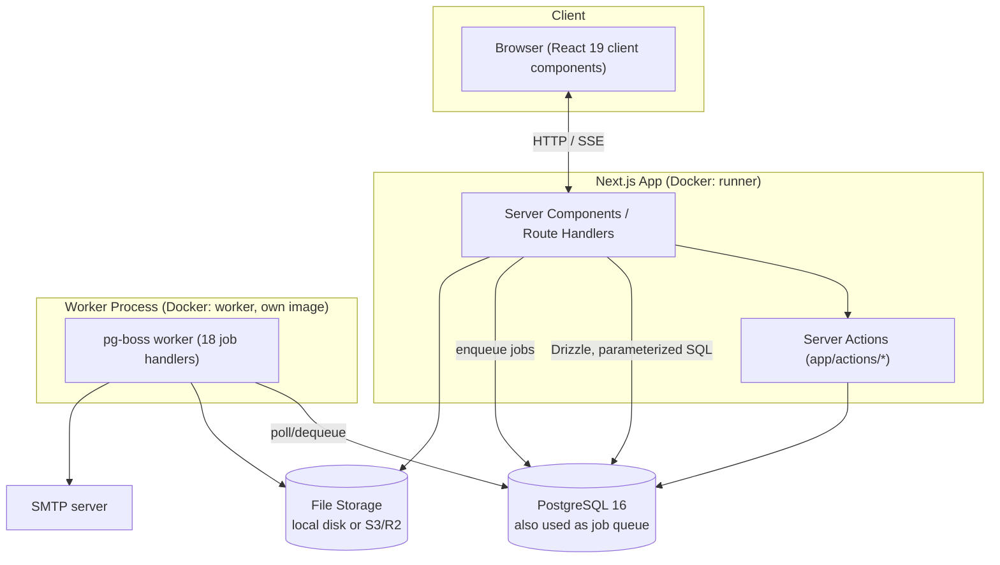
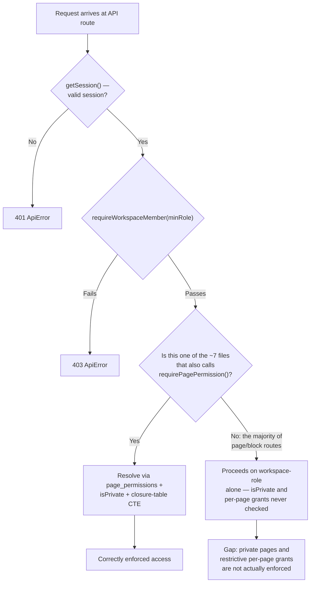

# Workflix (Pagevo) — Production Readiness Review

**Scope:** `main` branch, commit `d4c77a0` ("Merge pull request #42 from Khushbu-snapdevio/fix/app-issues")
**Method:** Static analysis of the full repository via a read-only `git worktree` checkout of `main`. No files were modified as part of this review. No `npm audit` / dynamic testing was executed — all findings are from source inspection.
**Reviewer role:** Senior Staff Software Engineer / Security Engineer / DevOps Engineer / Solutions Architect (AI-assisted review).

> A note on branches: the working repository currently has a large amount of unmerged, in-progress work on branch `improved-some-functionallity` (privacy pills, breadcrumbs, a private-pages sidebar section, etc.). Per the review brief, this document evaluates `main` only and does not reflect that unmerged work.

---

## 1. Executive Summary

**Project purpose:** Workflix is a Notion-style team workspace ("Notion's core, pre-assembled") targeted at small teams (3–15 people) who find Notion overwhelming to configure. It is self-hostable via Docker Compose or deployable to a persistent-connection host.

**Primary features:** Hierarchical pages with a block-based rich-text editor (30 block types), databases with four view types (table/board/gallery/calendar) including formulas and rollups, page sharing with granular permissions and public links, comments (page- and cell-level), real-time-ish notifications (SSE), a template gallery, trash with version history, and an internal "Orbit" platform-admin panel.

**Current development status:** **Far past pre-development**, despite two top-level docs (`DEVELOPMENT-PLAN.md`, `doc/README.md`) still carrying stale "pre-development, no code exists yet" headers. The actual codebase is a large, largely feature-complete application: 32 database tables, 97 API routes, ~169 components, and a full editor/database/sharing/notifications/admin surface. Three subsystems are explicit, documented stubs: PDF export (`export/route.ts` returns HTTP 501), Orbit analytics (hardcoded `null` metrics), and the email-webhook event handler (authenticates real payloads, then discards them).

**Technology stack:** Next.js 16 (App Router) + React 19 + TypeScript 6 (strict) + Tailwind CSS v4 + Radix UI + TipTap 3 (editor) + PostgreSQL + Drizzle ORM + Better Auth + pg-boss (background jobs, Postgres-backed) + Nodemailer (SMTP) + S3-compatible storage. Full detail in §3.

**Overall architecture:** Server-rendered Next.js App Router monolith (~80% Server Components) talking directly to Postgres via Drizzle (no repository/service layer), plus a separate worker process (own Dockerfile) for background jobs via pg-boss. No microservices, no message broker beyond Postgres itself, no edge middleware.

**Estimated production readiness: ~40 / 100.** See §28 for the full scorecard and §29 for the final recommendation.

**Biggest strengths:**
- A genuinely sophisticated data model: closure-table page hierarchy (`page_closure`) enabling O(1) ancestor/subtree queries, plus a well-designed (if under-enforced — see weaknesses) page-permission resolver with recursive-CTE inheritance.
- Clean security fundamentals in the areas that were done: **zero SQL-injection surface** (100% parameterized Drizzle/`sql` template usage), no hardcoded secrets, boot-time secret validation (`lib/env.ts`), consistent Zod validation on most routes, well-implemented file uploads (MIME/size/quota checks, server-generated object keys), and a well-built admin-impersonation subsystem with hard TTL + audit logging.
- Modern, currently-maintained dependency stack with no deprecated packages.
- Thorough self-hosting documentation (`SELF-HOSTING.md`, `SAAS-TO-SELF-HOSTED.md`) and Docker packaging with sane multi-stage builds, non-root containers, and healthchecks.

**Biggest weaknesses:**
- **Critical authorization gap:** the page-permission resolver (`lib/permissions/resolver.ts`) that enforces `isPrivate` pages and per-page access grants is bypassed by nearly every primary page/block read and write endpoint, which check only coarse workspace-role membership. See §14, Finding #1.
- **Zero automated tests** of any kind (no unit, integration, or E2E tests) across ~97 API routes, the permission system, the editor, and all background jobs.
- No rate limiting beyond Better Auth's own in-memory default; no security headers (CSP/HSTS/X-Frame-Options) anywhere; an SSRF-exposed link-preview endpoint; auth-bypass tokens (magic-link/reset URLs) logged in plaintext.
- No CI enforcement of lint/typecheck/tests (the only CI job validates that Docker images build).
- The notifications SSE endpoint is a 10-second DB long-poll capped at 55 seconds per connection, explicitly documented in-code as unsuitable for serverless hosts (e.g. Vercel) — a real constraint on where this app can be deployed.

---

## 2. Project Structure

```
app/                          Next.js App Router — pages, layouts, API routes, server actions
├─ api/                       97 route.ts files — the entire REST API surface (see §8)
├─ app/                       Authenticated workspace UI: [workspace]/[pageId], library,
│                             templates, trash, settings/*, workspaces/new|setup
├─ auth/                      Login, forgot/reset-password pages
├─ orbit-admin/               Internal platform-admin panel UI (analytics, audit, users, etc.)
├─ invite/                    Workspace + guest invitation acceptance flows
├─ p/[token]/                 Public share-link viewer (no auth, token-gated)
├─ platform/                  Post-signup onboarding / post-auth routing
├─ actions/                   Next.js server actions (auth, onboarding, orbit-users, profile, workspaces)
├─ privacy/, terms/           Static legal pages
└─ layout.tsx, page.tsx, error.tsx, globals.css   Root shell, landing page, global error boundary

components/                   169 files, organized by feature (not by type)
├─ database/ (26)             Table/board/gallery/calendar views, cells, toolbar, filters
├─ editor/ (11 + extensions/) TipTap block editor, block-registry, serializer, comment gutter
├─ pages/ (14)                Page chrome: header, share panel, comments, trash banner
├─ sidebar/ (6)                Page tree, favorites, recently-visited, workspace switcher
├─ orbit/ (13)                 Admin-panel-specific components
├─ templates/ (3 + views/)     Template gallery + per-view-type template previews
├─ settings/ (9), notifications/ (5), onboarding/ (3), search/ (3), workspace/ (6),
│  admin/ (2), auth/ (1), landing/ (3), layout/ (2)
└─ ui/ (47)                    Radix-wrapped design-system primitives (shadcn-style)

lib/                          Core domain logic — no framework code here
├─ db/                        Drizzle client (index.ts), schema/ (11 domain files), queries/
├─ auth/                      Better Auth server config, client, DB-backed method-toggle settings
├─ authz.ts                   Redirect-based session/admin guards (RSC/page contexts)
├─ workspaces/auth.ts         Throw-based session/workspace-role guards (API route contexts)
├─ permissions/resolver.ts    Page-level ACL resolution (closure-table recursive CTE)
├─ pages/                     closure.ts (tree maintenance), ancestors.ts
├─ jobs/                      pg-boss setup (boss.ts, enqueue.ts, register.ts), handlers/ (18 jobs)
├─ storage/drivers/           Pluggable file storage: local.ts, s3.ts
├─ email/, smtp/              React-email templates + Nodemailer SMTP transport
├─ notifications/, search/, orbit/, templates/, formula/, workspaces/invites.ts
└─ env.ts                     Zod-validated environment schema (single source of truth for env vars)

hooks/                        3 small reusable React hooks
config/                       Static config: product name/description, role definitions
drizzle/                      17 SQL migration files (0000–0016) + drizzle-kit metadata
scripts/                      dev-db.ts, migrate.ts, reset.ts, worker.ts, make-admin.ts
public/                       Static assets (icons, logo, favicons)
doc/                          Product/architecture spec docs — see §caveat below
.github/workflows/            One workflow: docker-build.yml (build-only, no test/lint gate)
Dockerfile, Dockerfile.worker,
docker-compose.yml,
docker-compose.external-db.yml   Container packaging for app + worker + optional local Postgres/S3/SMTP
```

**Documentation caveat:** `DEVELOPMENT-PLAN.md` and `doc/README.md` both open with "Status: pre-development, no application code exists yet" headers that are clearly stale given the actual codebase. `SAAS-TO-SELF-HOSTED.md` (dated 2026-07-06) and the code itself are the current sources of truth; the pre-development docs should be updated or removed to avoid misleading new contributors.

---

## 3. Tech Stack

| Category | Technology | Version |
|---|---|---|
| Framework | Next.js (App Router, standalone output, Turbopack dev) | 16.2.9 |
| Runtime | Node.js (Docker base image) | 22 (bookworm-slim) |
| Language | TypeScript (strict mode) | ^6.0.3 |
| UI Library | React / React DOM | ^19.2.7 |
| Database | PostgreSQL | 16 (alpine, via Compose) |
| ORM | Drizzle ORM / drizzle-kit | ^0.45.2 / ^0.31.10 |
| DB Driver | `postgres` (porsager) | ^3.4.9 |
| Authentication | Better Auth (+ admin, magic-link plugins) | ^1.6.18 |
| Editor | TipTap (react/pm/starter-kit + ~15 extensions) | ^3.26–3.27 |
| Styling | Tailwind CSS | ^4.3.1 |
| Component Primitives | `radix-ui` (consolidated package) | ^1.5.0 |
| Icons | `@phosphor-icons/react`, `lucide-react` | ^2.1.10 / ^1.21.0 |
| Drag & Drop | `@dnd-kit/{core,sortable,utilities}` | latest |
| State Management | None (React state/context + Server Components) | — |
| Background Jobs | pg-boss (Postgres-backed queue, no Redis) | ^12.19.1 |
| Email | Nodemailer (SMTP) + react-email | ^8.0.11 / ^6.6.0 |
| File Storage | AWS SDK S3 client + presigner (S3/R2), local-disk driver | ^3.1070.0 |
| Validation | Zod | ^4.4.3 |
| Deployment | Docker (multi-stage), Docker Compose | — |
| Package Manager | pnpm | 11.6.0 |
| Testing | **None configured** | — |
| Linting/Formatting | Biome (`ultracite` preset) | 2.5.0 |
| CI/CD | GitHub Actions — Docker build sanity check only | — |
| Local Dev DB | `embedded-postgres` (no Docker required) | 18.4.0-beta.17 |
| Math Rendering | KaTeX | ^0.17.0 |

**Version risk note:** Next.js 16, TypeScript 6, Tailwind 4, and Zod 4 are all very recent major-version lines. Nothing here is broken, but this is a bleeding-edge combination worth periodic compatibility verification (TipTap 3.x + drizzle-kit 0.31 + biome 2.5 on top of TS 6) rather than a "boring, battle-tested" stack.

---

## 4. Application Architecture

### High-level architecture



### Request lifecycle
1. **Client flow:** Browser hits a Next.js route. ~80% of `page.tsx` files are Server Components that fetch data directly via Drizzle before render; interactive leaves are `"use client"` components (naming convention: `*-client.tsx`).
2. **Server flow:** `app/app/layout.tsx` → `requireSession()` (redirect-based guard, `lib/authz.ts`) → `app/app/[workspace]/layout.tsx` resolves the workspace by slug and calls `getWorkspaceMember()`. No `middleware.ts` exists anywhere — protection is enforced per-layout/per-route-handler, not at the edge.
3. **API flow:** Route handlers under `app/api/**/route.ts` call `getSession()` (throw-based, `lib/workspaces/auth.ts`) then a coarse `requireWorkspaceMember(workspaceId, userId, minRole)` check (and, on a minority of routes, the finer-grained `requirePagePermission()`). See §9 and §14 for the significant gap here.
4. **Database interactions:** Direct Drizzle calls in route handlers — no repository/service layer. Raw SQL is used narrowly and safely (parameterized `sql` tagged templates) for the permission-resolver's recursive CTE and full-text search.
5. **External services:** SMTP (Nodemailer) for transactional email, S3/R2/local-disk for file storage, optional Google OAuth.
6. **Background jobs:** API routes enqueue jobs into a Postgres table via `lib/jobs/enqueue.ts`; a separate worker process (own container) dequeues and executes them via pg-boss (`lib/jobs/register.ts`, 18 handlers — see §7).

### Authentication flow
Better Auth issues a DB-backed session (not JWT) on successful login via one of three methods — magic link, email+password, or Google OAuth (all three are implemented and independently admin-toggleable at runtime; see §9 for why this contradicts the product's "magic-link only" description). Session cookie is `httpOnly`, `sameSite: lax`, with a 60-second in-memory cache to avoid a DB hit per request, and Better Auth's default 7-day expiration (not overridden).

### Authorization flow



### File upload flow
Client requests a signed upload URL (`POST /api/uploads/sign`, Zod-validated MIME/size, workspace-quota-checked) → uploads directly to storage (S3 presigned PUT or local driver) → client confirms (`POST /api/uploads/confirm`, ownership-checked, storage-usage incremented transactionally). Object keys are server-generated UUIDs, not client-controlled, which prevents path traversal / overwrite attacks.

### Payment flow
**Not Implemented.** No Stripe/payments code found anywhere in the repository — this is a self-hosted product with no billing surface.

---

## 5. Feature Inventory

| Feature | Status | Key Files | DB Tables | Known Limitations |
|---|---|---|---|---|
| Block editor | Implemented (30 block types) | `components/editor/{block-registry,editor,serializer}.ts`, `extensions/*` | `blocks`, `pages` | Only one `next/dynamic` usage in the whole editor — most extensions are bundled eagerly, not code-split |
| Database views (table/board/gallery/calendar) | Implemented, all 4 types wired | `components/database/{table,board,gallery,calendar}-view.tsx`, `toolbar.tsx`, `grouping.ts` | `databaseViews`, `databaseProperties`, `propertyValues` | `entries` GET loads the full entry set and filters/sorts in JavaScript rather than in SQL — a real scale ceiling, acknowledged in code comments |
| Formulas & Rollups | Implemented | `lib/formula/*` (hand-rolled parser/evaluator, no `eval`), `app/api/databases/[id]/entries/route.ts` | `databaseProperties`, `propertyValues` | Computed per-request, not cached; rollups issue one extra query per rollup property per request |
| Sidebar (page tree, favorites, recents, trash) | Implemented | `components/sidebar/*` | `userFavorites`, `userRecentlyVisited`, `pages` | — |
| Sharing & public links | Implemented | `components/pages/share-panel.tsx`, `app/api/pages/[id]/public-link`, `app/p/[token]/page.tsx` | `pagePermissions`, `publicLinks` | The permission model this relies on is under-enforced on the content routes themselves — see §14 #1 |
| Comments (page + database-cell) | Implemented | `components/editor/comment-*`, `components/database/cell-comment-popover.tsx` | `comments` | `comments/[id]/react` has no workspace/page permission check (session-only) |
| Notifications | Implemented, SSE-based | `app/api/notifications/stream/route.ts`, `components/notifications/*` | `notifications`, `notificationPreferences` | 10s DB long-poll, 55s connection cap — explicitly documented as unsuitable for serverless hosting |
| Templates gallery + admin CMS | Implemented | `templates-page-client.tsx`, `template-page-client.tsx`, `app/orbit-admin/orbit/templates/*` | `templates` | Public listing lazily re-seeds on every GET with swallowed errors; 5-per-workspace cap has a documented-but-unimplemented row lock (TOCTOU race) |
| Trash / version history | Implemented (30-day trash retention, 7-day version retention) | `app/app/[workspace]/trash/*`, `.../history/*` | `pages` (soft-delete), `pageVersions` | — |
| Orbit (platform admin panel) | Implemented | `app/orbit-admin/**`, `app/api/orbit/**` | `platformAuditLog` + most tables (read/manage) | Two divergent admin-gate helpers exist with different strictness; a session-token leak in `GET /api/orbit/users/[id]`; `requireAdmin()`'s failure redirect targets a nonexistent `/dashboard` route |
| Background jobs (18 handlers) | Implemented | `lib/jobs/handlers/*` | — | PDF export, admin storage-threshold notification, and orphaned-media 7-day-version check are explicit stubs (see §7) |
| Guest invitations | Implemented | `app/invite/guest/[token]`, `guestInvitations` table | `guestInvitations` | — |
| Workspace transfer | Implemented | `app/api/workspaces/[id]/transfer*` | `workspaces` | Confirmation step is a side-effecting, unauthenticated `GET` (link-prefetch risk) |
| PDF export | **Not Implemented** (stub) | `lib/jobs/handlers/export-page.ts` (TODO Phase 7) | — | Route returns HTTP 501 |
| Real-time collaborative editing | **Not Implemented** (deferred by design, Phase 2 per docs) | — | — | — |
| Public API / webhooks (outbound) | **Not Implemented** | — | — | Inbound `webhooks/email` exists but its handler is a no-op |
| Payments/billing | **Not Implemented** | — | — | Self-hosted product, not applicable |

---

## 6. Routing

### Public / marketing (no auth)
`app/page.tsx` (landing, redirects to `/app` if session exists), `app/privacy`, `app/terms`, `app/error.tsx` (the **only** error boundary in the app).

### Auth entry points (no session required)
`app/auth/login`, `app/auth/forgot-password`, `app/auth/reset-password`, `app/invite/[token]`, `app/invite/guest/[token]`, `app/api/auth/[...all]` (Better Auth catch-all).

### Authenticated workspace app — `/app/*` (session + workspace-membership required)
Guarded at `app/app/layout.tsx` (`requireSession()`) and re-validated at `app/app/[workspace]/layout.tsx` (`getWorkspaceMember()`). Routes: `workspaces/new`, `workspaces/setup/[slug]`, `[workspace]` (home), `[workspace]/new`, `[workspace]/new-database`, `[workspace]/library`, `[workspace]/search`, `[workspace]/templates`, `[workspace]/trash`, `[workspace]/[pageId]` (main editor), `[workspace]/[pageId]/history`, `[workspace]/t/[pageId]` (alternate short-link route), `[workspace]/settings/{general,members,notifications,profile,sessions}` (settings layout independently re-checks membership).

Note: `app/app/[workspace]/notifications/` exists as a directory containing only `.gitkeep` — **not implemented as a page route** (notifications are surfaced via a panel/provider instead).

### Public share links — `/p/[token]` (token-gated, no session)
`app/p/[token]/page.tsx` — validates `publicLinks.isActive` and token directly against the DB; falls back to a "not public" screen if the link is invalid/inactive/deleted.

### Internal admin — `/orbit-admin/*` (admin-only)
Guarded at `app/orbit-admin/layout.tsx` via `requireAdmin()`. Routes: `orbit` (dashboard), `orbit/analytics`, `orbit/audit`, `orbit/email`, `orbit/queues`, `orbit/settings`, `orbit/templates` (+ `new`, `[id]/edit`), `orbit/users` (+ `[id]`), `orbit/workspaces` (+ `[id]`).

### API routes
97 files under `app/api/**/route.ts`, fully enumerated in §8.

**Not Implemented:** no `not-found.tsx` anywhere in `app/` (Next's default is used everywhere `notFound()` is called, in 15 files); no `robots.txt` / `sitemap.ts`.

---

## 7. Database

**Type:** PostgreSQL 16, accessed via Drizzle ORM (`postgres` driver, snake_case column casing). Schema defined in `lib/db/schema/*.ts` (11 domain files + shared `types.ts`), migrations in `drizzle/` (17 files, applied via a custom transactional runner — `scripts/migrate.ts` — because migration `0003` requires `ALTER TYPE ... ADD VALUE`, which Postgres forbids inside the same transaction that references the new value).

**Total tables: 32**

| Domain file | Tables |
|---|---|
| `auth.ts` | `users`, `sessions`, `accounts`, `authSettings` (singleton), `verifications` |
| `workspace.ts` | `workspaces`, `workspaceSlugRedirects`, `workspaceMembers` |
| `pages.ts` | `pages`, `pageClosure`, `pageVersions`, `blocks` |
| `databases.ts` | `databaseViews`, `databaseProperties`, `propertyValues` |
| `sharing.ts` | `pagePermissions`, `publicLinks`, `guestInvitations` |
| `collaboration.ts` | `comments`, `notifications`, `notificationPreferences`, `emailOutbox` |
| `search.ts` | `searchIndex`, `searchQueryLog` |
| `templates.ts` | `templates` |
| `files.ts` | `fileUploads`, `workspaceStorageUsage` |
| `user-state.ts` | `userPreferences`, `userHintStates`, `userFavorites`, `userRecentlyVisited` |
| `platform.ts` | `platformAuditLog` |

### Notable design elements
- **`pageClosure`** — a closure table `(ancestorId, descendantId, depth)` maintained transactionally by `lib/pages/closure.ts`, giving O(1) subtree/ancestor lookups without recursive CTEs for most tree operations. The permission resolver still uses a `WITH RECURSIVE` CTE for inheritance walks.
- **`pages`** is a universal content node (`kind`: page/database/entry) — databases and their entries are themselves rows in `pages`, not a separate table.
- Indexes are present on the hot paths that were sampled: `pages_live_tree_idx(workspaceId, isDeleted)`, `sessions_user_idx`, GIN index on `propertyValues.value` (jsonb) and on `searchIndex.searchVector` (tsvector), composite `(pageId, orderIndex)` on `blocks`.
- Constraints: CHECK constraints enforce `authSettings` singleton (`id=1`) and tie `fileUploads.kind='user_avatar'` to `workspaceId IS NULL`. Foreign keys consistently use `cascade`/`set null` deletion policies appropriate to each relationship.
- **Migrations (17, `0000`→`0016`):** initial schema → `workspaces.kind` → filter-logic enum + reactions → `default_page_access` enum extension → database-cell comment columns → board/view settings jsonb → block-type enum extensions (pdf/embed/bookmark/breadcrumb/synced_block/sub_page) → notification-preference columns → `auth_settings` table + password column → notification/audit enum extensions → search query log table → `status`/`rollup`/`formula` property types added incrementally.

**Potential bottlenecks:**
- `GET /api/databases/[id]/entries` loads the entire entry+property-value set for a database and filters/sorts in application code rather than pushing predicates into SQL — the single largest scalability concern identified in this review (self-acknowledged in code comments as a deliberate simplification).
- Numerous N+1 query patterns across mutation routes (block autosave, page duplication, property reorder/delete cascades, favorites reorder, search reindex, template icon backfill) — individually low-impact, collectively a real cost at scale. Full list in §13.
- Notification SSE polls the DB every 10 seconds per open connection with no LISTEN/NOTIFY or pub/sub layer — DB load scales linearly with concurrently connected clients.

**Seed data:** Built-in templates are auto-seeded on worker startup and lazily re-seeded on template-listing GET requests (`lib/jobs/register.ts`, `app/api/templates/route.ts`).

**Backups:** No application-level backup automation found in the codebase; `SELF-HOSTING.md` documents this as an operator responsibility (standard `pg_dump`/managed-Postgres-provider backups).

---

## 8. API Documentation

**Scope note:** 97 route files were fully read across feature areas. Given the volume, this section documents every route grouped by feature area with method, purpose, and the auth/validation pattern actually observed, rather than a full request/response schema per endpoint (which would run to several hundred pages). Full findings, including security-relevant gaps per route, are cross-referenced into §14.

**Auth pattern legend:** all routes require a valid session (`getSession()`/`ApiError(401)`) unless marked *public*. "WS-role(X)" = `requireWorkspaceMember(..., minRole=X)`. "Page-perm(X)" = `requirePagePermission(..., minLevel=X)` (the stronger, under-used check — see §14 #1). "Admin" = `requireAdmin()`/`requirePlatformAdmin()`.

### Pages, Blocks & Comments
| Route | Methods | Purpose | Auth | Validation |
|---|---|---|---|---|
| `/api/pages` | POST | Create page (+ initial block, closure row, search index) | WS-role(editor) | Zod `createPageSchema` |
| `/api/pages/[id]` | GET, PATCH, DELETE | Fetch / update / soft-or-hard-delete a page | WS-role(viewer/editor) — **not page-perm; see §14 #1** | Zod `.strict()` on PATCH |
| `/api/pages/[id]/ancestors` | GET | Breadcrumb chain | WS-role | — |
| `/api/pages/[id]/blocks` | GET, POST | Load / create blocks (primary editor content path) | WS-role(viewer/editor) — **not page-perm** | partial |
| `/api/pages/[id]/duplicate` | POST | Deep-copy a page subtree | WS-role(editor) | — (N+1 recursive inserts) |
| `/api/pages/[id]/export` | POST | Markdown/HTML export | WS-role | — (PDF path returns 501, not implemented) |
| `/api/pages/[id]/lock` | POST | Toggle page lock | WS-role(editor) | comment admits full perm-check "deferred to Phase 12" |
| `/api/pages/[id]/move` | PATCH | Reparent page (closure-table maintained) | WS-role(editor) | — |
| `/api/pages/[id]/permissions` | GET, POST, DELETE | Grant/revoke page ACL | **Page-perm(full_access)** — correct | Zod `grantSchema` |
| `/api/pages/[id]/public-link` | GET, POST, DELETE | Manage share link (token rotates on re-enable) | **Page-perm(full_access)** — correct | — |
| `/api/pages/[id]/restore` | POST | Restore from trash | WS-role(editor) | — |
| `/api/pages/[id]/versions`, `/versions/[versionId]/restore` | GET, POST | Version history; restore snapshots current state first | WS-role(editor) | — |
| `/api/pages/[id]/guests/invite`, `/guests/[guestId]` | POST, DELETE | Guest sharing | **Page-perm** — correct | DELETE does 2 non-transactional deletes |
| `/api/blocks/batch` | POST | Editor autosave (bulk upsert) | WS-role(**viewer** default — no editor requirement) | Zod, but per-block upsert loop (N+1) |
| `/api/blocks/[id]` | PATCH, DELETE | Single block mutation | WS-role(**viewer** default) | `updates as any` |
| `/api/blocks/[id]/synced-content` | GET | Resolve synced-block source content | WS-role | — |
| `/api/pages/[id]/comments` | GET, POST | Page comments | **Page-perm** (correct); GET has dead/broken filter code | — |
| `/api/pages/[id]/comments/[commentId]` | PATCH, DELETE | Edit/delete comment | author-or-admin | — |
| `/api/comments/[id]` | PATCH, DELETE | Parallel comment-action surface (duplicated vs. above) | author-only (PATCH), author-or-WS-admin (DELETE) | — |
| `/api/comments/[id]/react` | POST | React to a comment | **session-only — no workspace/page permission check at all** | — |
| `/api/comments/[id]/resolve`, `/reopen` | POST | Resolve/reopen thread | Page-perm | — |

### Databases & Entries
| Route | Methods | Purpose | Auth | Validation |
|---|---|---|---|---|
| `/api/databases/[id]` | GET | Database + views + properties | WS-role | — |
| `/api/databases/[id]/properties` | GET, POST | List/create properties (50-property cap, two-way relation mirroring) | WS-role | No Zod — manual allowlist only |
| `/api/databases/[id]/properties/[propId]` | PATCH, DELETE | Update/delete property | WS-role | Destructive type-conversion not wrapped in one transaction; DELETE scrubs filters/sorts per-view (N+1) |
| `/api/databases/[id]/properties/reorder` | PATCH | Reorder properties | WS-role | Per-id update loop (N+1); **no check that ids belong to this database** |
| `/api/databases/[id]/views`, `/views/[viewId]` | GET, POST, PATCH, DELETE | Manage views | WS-role | No enum validation on `type`/`filterLogic`; DELETE's default-view promotion non-transactional |
| `/api/databases/[id]/entries` | GET, POST | List/create entries (computes rollups/formulas) | WS-role | GET filters/sorts in JS, not SQL (see §7); `viewId` not scoped to `databaseId` |
| `/api/entries/[id]/property-values`, `/property-values/[propId]` | GET, PATCH | Read/upsert a cell value | WS-role | Person-assignment notifications fire in a separate transaction per assignee (N+1) |

### Workspaces, Invitations & Templates
| Route | Methods | Purpose | Auth | Validation |
|---|---|---|---|---|
| `/api/workspaces` | GET, POST | List/create workspace (creator becomes admin) | session | transactional create |
| `/api/workspaces/[id]` | GET, PATCH, DELETE | Read/update/delete workspace | WS-role(admin) | PATCH handles slug-redirect correctly; DELETE has no visible cascade guard |
| `/api/workspaces/[id]/members`, `/members/[userId]` | GET, POST, PATCH, DELETE | Member management | WS-role(admin) | Strong privilege-escalation protections (owner-only admin-grant, last-admin protection) |
| `/api/workspaces/[id]/invite-link` | GET, POST, DELETE | Shareable invite-link token | WS-role(**any member, incl. viewer, can read the live token**) | — |
| `/api/workspaces/[id]/invitations/[inviteId]`, `/resend` | DELETE, POST | Invite lifecycle | WS-role(admin) | token rotated on resend |
| `/api/workspaces/[id]/pages/tree` | GET | Page-tree sidebar data | WS-role | comment admits BOLA enforcement is incomplete ("deferred to Phase 12") |
| `/api/workspaces/[id]/storage` | GET | Storage usage breakdown | WS-role (admins see full breakdown) | hardcoded 5GB quota |
| `/api/workspaces/[id]/databases` | GET, POST | List/create databases in workspace | **`requireSession()` (redirect-based) — the one inconsistent file in this group** | no Zod, no top-level try/catch |
| `/api/workspaces/[id]/transfer`, `/transfer/confirm` | POST, GET | Ownership transfer | POST: WS-role(admin, owner-only); **GET confirm: token-only, no session check, side-effecting** | — |
| `/api/invite/[token]/accept`, `/set-password`, `/api/invite/guest/[token]` | POST, GET | Invite acceptance | token + invited-email-must-match-session-email (correct) | `set-password` masks real errors as "log in manually" |
| `/api/templates`, `/templates/[id]/use` | GET, POST | Public template listing / instantiate | session | listing lazily re-seeds on every GET, swallows errors |
| `/api/workspaces/[id]/templates`, `/templates/[templateId]` | GET, POST, PATCH, DELETE | Workspace-scoped custom templates | WS-role | **comment claims a `FOR UPDATE` lock caps templates at 5; no such lock exists — TOCTOU race** |

### Orbit (Platform Admin) — 17 routes
All require `requireAdmin()` or the parallel `requirePlatformAdmin()` (see §14 #6 for why these two diverge), and every mutating route writes to `platformAuditLog`. Covers: `analytics` (activation/search/feature-usage are hardcoded `null` stubs), `audit` (unvalidated `limit`/`offset`), `auth-settings` (Zod-validated, audit-logged), `email/[id]/retry`, `templates/*` (CRUD + publish/unpublish/seed), `users/*` (list/detail/ban/unban/impersonate/revoke-sessions), `workspaces/*` (list/detail/force-delete — irreversible, bypasses the app's own trash system).

### User Settings, Auth, Notifications, Uploads, Search, Misc — 28 routes
- `/api/auth/[...all]` *(public)* — Better Auth catch-all. `/api/auth/methods` *(public)* — surfaces enabled auth methods + first-run bootstrap flag.
- `/api/account/export`, `/api/user/account` (self-delete, blocked if sole active admin), `/api/user/favorites*`, `/api/user/notification-preferences`, `/api/user/preferences`, `/api/user/profile`, `/api/user/recently-visited`.
- `/api/notifications` (GET, in-memory type filtering post-fetch), `/[id]/read`, `/read-all`, `/clear-all`, `/test` (dev-only, 404s in production), `/stream` *(SSE, see §7)*.
- `/api/uploads/sign` (Zod MIME/size/quota validated, **no explicit workspace-membership check**, only quota check), `/confirm` (ownership-checked), `/local` (dev driver), `/files/[...path]` (serves local-storage files with **no auth**, by design; path-traversal correctly guarded).
- `/api/search` *(parameterized full-text search, no injection risk, correctly excludes others' private pages)*, `/search/reindex` (per-page insert loop, N+1, viewer-role-only for a bulk-write op).
- `/api/webhooks/email` — HMAC-style constant-time secret comparison (well implemented auth), **but the handler body is a no-op stub**.
- `/api/health` *(public)* — unauthenticated DB liveness probe (`SELECT 1`).
- `/api/link-preview` — fetches user-supplied URLs server-side; **SSRF-exposed**, see §14 #2.

---

## 9. Authentication & Authorization

### Login flow
Three methods are actually implemented and independently admin-toggleable at runtime via a DB-backed singleton (`authSettings` table, `lib/auth/settings.ts`, managed at `/api/orbit/auth-settings`):
1. **Magic link** — `magicLink` plugin, email sent via `enqueueEmail`.
2. **Email + password** — full implementation including reset-password; self-serve sign-up is restricted to first-admin bootstrap, but sign-in with an existing password remains fully active.
3. **Google OAuth** — wired whenever `GOOGLE_CLIENT_ID`/`GOOGLE_CLIENT_SECRET` are set.

**This contradicts the product's documented "magic-link only, no passwords/OAuth" description** — recorded here as a genuine spec-vs-implementation mismatch, not a defect in the code itself (the multi-method implementation is solid).

### Session handling
DB-backed session (Better Auth's standard model, not JWT), 60-second in-memory cookie cache, 7-day default expiration (not overridden by app config). Every server entry point validates via `auth.api.getSession()`, wrapped consistently by `lib/authz.ts:getCurrentSession()`/`requireSession()` and `lib/workspaces/auth.ts:getSession()`.

### Token storage / cookies
`httpOnly: true`, `sameSite: "lax"`, `secure`/`__Secure-` prefix conditional on `NEXT_PUBLIC_APP_URL` being `https://` (Better Auth default, not overridden). **Self-hosting risk:** an operator deploying with an `http://` `NEXT_PUBLIC_APP_URL` behind a TLS-terminating reverse proxy would silently lose the secure-cookie flag unless `advanced.useSecureCookies` is explicitly set.

### OAuth providers
Google only, optional (env-gated).

### Roles & permissions
Two independent tiers:
1. **Workspace role** (`viewer` < `editor` < `admin`) — `lib/workspaces/auth.ts`, used almost everywhere.
2. **Page-level ACL** (`can_view`/`can_comment`/`can_edit`/`full_access`) with closure-table inheritance — `lib/permissions/resolver.ts`. Well-designed but **called from only 7 of ~40 relevant route files** — see §14 #1 for the critical consequence.

Separately, a **platform-admin** tier (`users.isPlatformAdmin` / legacy `users.role`) gates the entire `/orbit-admin` surface.

### Route protection
No `middleware.ts` exists anywhere — protection is enforced per-layout (`app/app/layout.tsx`, `app/orbit-admin/layout.tsx`) and per-route-handler. This is not inherently broken but removes any network-layer backstop, which is part of why the §14 #1 gap went unnoticed on some routes while being correctly implemented on others.

### Session expiration & impersonation
7-day default session TTL. Admin impersonation (`admin` plugin) is well-built: 2-hour hard TTL enforced via a `databaseHooks.session.update.before` hook that force-invalidates expired impersonated sessions, `allowImpersonatingAdmins: false`, self-impersonation and banned-target impersonation both blocked, and every impersonation event is audit-logged.

### Security weaknesses in this subsystem (see §14 for full detail)
- Page-level authorization is effectively decorative on primary content routes (**Critical**).
- Magic-link, password-reset, and change-email URLs are logged to the console in plaintext (**High**).
- `GET /api/orbit/users/[id]` leaks the raw, replayable session token (**Medium/High**).
- Two divergent admin-gate helpers with inconsistent strictness (**Medium**).

---

## 10. Environment Variables

Source of truth: `lib/env.ts` (Zod-validated at process start — a misconfigured `.env` fails fast at boot, not mid-request) and `.env.example`.

| Name | Purpose | Required | Sensitive |
|---|---|---|---|
| `DATABASE_URL` | Postgres connection string | Yes | Yes |
| `APP_SECRET` | Session/crypto secret (Zod-enforced ≥32 chars, rejects the placeholder value) | Yes | Yes |
| `NEXT_PUBLIC_APP_URL` | Public base URL | Yes | No |
| `NODE_ENV` | Environment mode | No (default `development`) | No |
| `STORAGE_DRIVER` | `local` \| `s3` \| `r2` | No (default `local`) | No |
| `UPLOAD_DIR` | Local-disk upload path | No | No |
| `S3_ENDPOINT` | R2/MinIO endpoint (empty = AWS S3) | Conditional (driver=s3/r2) | No |
| `S3_BUCKET` / `S3_REGION` | S3 bucket/region | Conditional | No |
| `S3_ACCESS_KEY_ID` / `S3_SECRET_ACCESS_KEY` | S3 credentials | Conditional | Yes |
| `CDN_URL` | CDN base URL for served files | No | No |
| `SMTP_HOST` / `SMTP_PORT` / `SMTP_USER` / `SMTP_PASS` | SMTP transport | No (dev logs emails without it) | `USER`/`PASS`: Yes |
| `EMAIL_FROM` | From address | No | No |
| `EMAIL_WEBHOOK_SECRET` | Inbound delivery-webhook auth | No | Yes |
| `GOOGLE_CLIENT_ID` / `GOOGLE_CLIENT_SECRET` | Google OAuth | No | `SECRET`: Yes |
| `POSTGRES_USER` / `POSTGRES_PASSWORD` / `POSTGRES_DB` / `POSTGRES_PORT` | Bundled-Postgres bootstrap (Compose only) | Compose-only | `PASSWORD`: Yes |
| `APP_PORT` | Host-side app port (Compose only) | Compose-only | No |
| `MINIO_ROOT_USER` / `MINIO_ROOT_PASSWORD` | Optional local MinIO profile | No | Yes |

No secret values are reproduced anywhere in this document.

---

## 11. Third-Party Integrations

| Integration | Usage |
|---|---|
| **Google OAuth** | Optional sign-in provider, env-gated, admin-toggleable |
| **S3-compatible storage (AWS S3 / Cloudflare R2 / MinIO)** | File uploads via presigned URLs (`lib/storage/drivers/s3.ts`); local-disk driver is the default/fallback |
| **SMTP (any provider)** | Transactional email via Nodemailer — magic links, invites, notifications, digests |
| **Mailpit / MinIO** | Optional local dev/self-hosting conveniences (Compose `extras` profile) — not third-party services, bundled stand-ins |

**Not integrated:** Stripe/payments, OpenAI/AI features, Firebase, Supabase, Resend, any product-analytics SDK (PostHog/Amplitude/Segment), any error-tracking SDK (Sentry/Datadog).

---

## 12. Code Quality Review

| Area | Score (1–10) | Notes |
|---|---|---|
| Folder organization | 8 | Clean feature-based structure; `ui/` correctly isolated as the one type-based bucket |
| Component structure | 6 | Sound composition patterns, but ~43 files exceed 400 lines, several past 1,000–2,200 |
| Reusability | 5 | A `withErrorHandler()` abstraction exists (`lib/workspaces/auth.ts:110`) but is used in **0 of 97** route files; the same try/catch/`instanceof ApiError` block is hand-rolled in 55 files instead |
| Naming conventions | 8 | Consistent camelCase/PascalCase/kebab-case across all sampled files |
| Type safety | 8 | `strict: true` genuinely enforced; `@ts-ignore`/`@ts-expect-error`: 0; `: any`: 0; `as any`: 7, all narrow and justified (ProseMirror internals, Drizzle dynamic `inArray`) |
| Error handling | 7 | Consistently try/catch-based, typed `ApiError`, no bare-swallow catches found in samples — but a real bug where `instanceof Response` checks against a non-`Response` `ApiError` class silently downgrade several routes' 401/403s to 500s |
| Code duplication | 5 | A `resolveX(id, userId)` load-and-authorize pattern is independently reimplemented in at least 17 route files rather than shared |
| Technical debt | 5 | See §24 |
| Maintainability | 6 | Feature-based org helps; oversized files and duplicated auth-resolution logic hurt |

**TODO/FIXME density:** only 4 `TODO` comments in the entire codebase (no `FIXME`/`XXX`/`HACK`), all in `lib/jobs/handlers/` and all describing genuinely-deferred work (PDF export, storage-threshold notification wiring, an orphaned-media edge case) — a good signal that the codebase isn't accumulating silent debt markers.

**Lint/format tooling:** Biome (`ultracite` preset) with `noExplicitAny: error` but many stylistic rules (magic numbers, non-null assertions, cognitive complexity) deliberately disabled — a pragmatic rather than maximalist posture. **Not enforced in CI** (see §16).

---

## 13. Performance Review

- **Rendering strategy:** ~80% Server Components at the route level (32/40 `page.tsx` files), which is appropriate for this data-heavy, per-request-dynamic app. Client components follow a clear `*-client.tsx` naming convention.
- **Code splitting:** `next/dynamic` used in exactly one file (`components/editor/extensions/reference-blocks.tsx`) — the editor's ~15 TipTap extensions and the 1,000–2,200-line template/database view components are otherwise bundled eagerly. This is a concrete bundle-size optimization opportunity.
- **Caching:** Minimal — no ISR (`revalidate` intervals), no `fetch` caching directives found. `force-dynamic` is used only on the SSE stream and the Orbit dashboard. This is defensible for a session-scoped app but means zero static optimization exists anywhere.
- **Image optimization:** `next/image` used in only 14 files (landing, auth, admin, onboarding); editor media blocks likely render user-uploaded images via plain ``, not `next/image`.
- **Database query efficiency:** the dominant performance theme of this codebase. The `entries` GET route loads a database's entire entry+property-value set and filters/sorts in JavaScript rather than in SQL — a real ceiling on database size before this becomes slow. Beyond that, N+1 patterns recur across: block-batch autosave (per-block upsert), page duplication (recursive per-row inserts), property delete (per-view filter/sort scrub), property/favorites reorder (per-id update loops), rollup computation (one query per rollup property per request), person-assignment notifications (one transaction per assignee), search reindex (per-page insert).
- **API performance:** no rate limiting exists at the application level (Better Auth's own in-memory default rate limiter covers only its own endpoints).
- **Memory/connection usage:** the notifications SSE endpoint holds a connection open per client and polls the DB every 10 seconds for up to 55 seconds — DB load scales linearly with concurrent connected users; explicitly documented in-code as unsuitable for a stateless serverless host.

**Optimization opportunities, roughly by leverage:** (1) rewrite `entries` GET to push filters/sorts into SQL, (2) batch the block-autosave upsert into a single statement, (3) introduce `next/dynamic` for the heavy editor extensions and the largest template/database view components, (4) replace or supplement the SSE long-poll with LISTEN/NOTIFY or a proper pub/sub layer if horizontal scaling or serverless hosting is a goal.

---

## 14. Security Audit

| # | Finding | Evidence | Severity | Recommendation |
|---|---|---|---|---|
| 1 | **Page-level permission resolver is bypassed by nearly every primary page/block read & write endpoint.** `isPrivate` pages and per-page ACL grants (`page_permissions`) are enforced only on the ~7 sharing-management routes; the actual content CRUD routes (`GET/PATCH/DELETE /api/pages/[id]`, `GET/POST /api/pages/[id]/blocks`, `PATCH/DELETE /api/blocks/[id]`, `POST /api/blocks/batch`, and the server-rendered page view itself) check only coarse workspace-role membership. Any workspace member — including `viewer`-role — can read/edit any page via its id, including private pages belonging to another user, and a user explicitly capped to `can_view` via a grant can still write through `/api/blocks/batch` or `/api/blocks/[id]`. | `app/api/pages/[id]/route.ts:20,63,108`; `app/api/pages/[id]/blocks/route.ts:7-20,46`; `app/api/blocks/[id]/route.ts:5-18`; `app/api/blocks/batch/route.ts:41`; `app/app/[workspace]/[pageId]/page.tsx:47-48,137` | **Critical** | Route all page/block read & mutation endpoints through `requirePagePermission()`/`getEffectivePermission()`, matching the pattern already correctly used on the sharing routes |
| 2 | **SSRF in the link-preview endpoint.** Fetches an arbitrary user-supplied URL server-side for Open Graph unfurling; validates scheme (http/https) only, with no private-IP/localhost/link-local/cloud-metadata blocklist, and follows redirects without re-checking the destination. | `app/api/link-preview/route.ts:43-66` | **High** | Resolve the hostname and reject private/loopback/link-local/metadata IP ranges before fetching; re-validate after each redirect hop |
| 3 | **Auth-bypass tokens logged in plaintext.** Magic-link, password-reset, and change-email URLs (each a bearer credential) are written to the console. | `lib/auth/index.ts:50-51, 125-126, 200-201` | **High** | Remove in production, or gate behind `NODE_ENV !== "production"` |
| 4 | **No security headers configured anywhere.** No CSP, `X-Frame-Options`, `X-Content-Type-Options`, `Referrer-Policy`, or `Strict-Transport-Security` — `next.config.mjs` has no `headers()` block and there is no middleware. | `next.config.mjs` (full file) | **Medium** | Add a `headers()` config or thin `middleware.ts` |
| 5 | **No application-level rate limiting.** Better Auth's own default limiter covers only its own endpoints, in-memory (not shared across replicas). No rate limiting on comments, page/block CRUD, uploads, invite/guest-token guessing, or search. | grep across repo | **Medium** | Add durable, replica-shared rate limiting on auth, invite/guest-token, and mutation-heavy routes |
| 6 | **Two divergent admin-gate implementations.** `requireAdmin()` (12/17 Orbit routes) checks legacy `users.role` and `banned`, but fetches (and never uses) `isPlatformAdmin`; a separately duplicated `requirePlatformAdmin()` (all 5 `templates/*` Orbit routes) checks only `role`, **omitting the `banned` check** — a banned admin retains platform-template management access through this path. | `lib/authz.ts`, `app/api/orbit/templates/route.ts:9-19` | **Medium** | Consolidate into one helper checking `isPlatformAdmin` and `banned` |
| 7 | **Session-token leak.** `GET /api/orbit/users/[id]` runs an unprojected `select()` on `sessions`, shipping the raw, replayable session token to the admin frontend. | `app/api/orbit/users/[id]/route.ts` | **Medium** | Project out the `token` column |
| 8 | **`comments/[id]/react` has no workspace/page permission check** — session-only. | `app/api/comments/[id]/react/route.ts` | **Medium** | Add a workspace-membership (at minimum) check |
| 9 | **Side-effecting, unauthenticated workspace-transfer confirmation via `GET`.** Relies solely on token possession; vulnerable to email-security-scanner link-prefetching auto-completing a transfer. | `app/api/workspaces/[id]/transfer/confirm/route.ts` | **Medium** | Convert to a POST requiring an explicit user action, or add a confirmation step |
| 10 | **TOCTOU race on workspace template cap.** A comment claims a `FOR UPDATE` row lock enforces the 5-template limit; no such lock exists. | `app/api/workspaces/[id]/templates/route.ts` | **Low** | Implement the lock the comment claims exists, or accept the race and remove the misleading comment |
| 11 | **`ApiError`/`Response` type-check bug.** Several notification routes check `if (e instanceof Response) return e` to special-case `ApiError`, but `ApiError` is an `Error` subclass, not a `Response` — the check is always false, silently downgrading thrown 401/403s to generic 500s. | notification route handlers | **Low** | Fix the `instanceof` check |
| — | **Strengths confirmed by this audit:** zero SQL-injection surface (100% parameterized Drizzle `sql` templates, including a well-designed recursive CTE); no command injection anywhere; minimal, safe `dangerouslySetInnerHTML` usage (KaTeX rendering only, `trust` implicitly false); no hardcoded secrets; boot-time secret validation; solid file-upload validation (MIME/size/quota, server-generated keys, path-traversal-guarded local serving); consistent Zod validation on most sampled routes; well-implemented webhook signature verification (constant-time comparison); well-built admin impersonation (hard TTL, audit-logged, self/banned-target blocked). | multiple files, see full agent findings | — | Maintain these patterns going forward |

---

## 15. Error Handling

- **Global error handling:** exactly one `error.tsx` in the entire app (`app/error.tsx`) — no segment-level boundaries under `/app`, `/orbit-admin`, or `/p`, so an error deep in, e.g., the database toolbar surfaces the same generic top-level boundary as any other failure.
- **API errors:** consistently typed via a custom `ApiError` class, thrown and caught per-route (see §12 for the duplication cost of this pattern, and §14 #11 for one concrete bug in how it's checked in a few routes).
- **UI errors:** `sonner` toast usage found in only 8 of 169 components — most async operations have local `try/catch` (162 catch blocks counted) but a minority surface no user-facing feedback on failure (e.g., a bare `catch {}` in `components/pages/page-client.tsx:93`).
- **Loading states:** `loading.tsx` present at 7 of the app's route segments; missing on `search`, `new`, `new-database`, `t/[pageId]`, all `settings/*` sub-pages, workspace creation/setup, and everything under `/orbit-admin`.
- **Empty states:** not exhaustively audited; spot-checked components (trash, templates gallery) do render explicit empty-state UI.
- **Retry mechanisms:** present at the background-job layer (pg-boss `retryLimit`/`retryDelay`, tuned per job — e.g. email sends retry 2–3 times with 30–60s delay for transient SMTP failures); no client-side request retry logic observed.
- **Logging:** plain `console.*` throughout (90 occurrences in `app/`/`lib`/`components`, excluding scripts) — no structured logging library.
- **Monitoring:** `instrumentation.ts` implements Next's `onRequestError` hook and formats chained errors nicely, but only logs to console — **no external error-tracking service is wired in** (Sentry or equivalent — see §16).

---

## 16. Production Readiness Checklist

| Item | Status | Notes |
|---|---|---|
| HTTPS | ⚠ Needs Improvement | App-level: relies entirely on the deployer's reverse proxy/host; no HSTS header set by the app itself |
| Security headers | ❌ Missing | No CSP/X-Frame-Options/HSTS/X-Content-Type-Options anywhere (§14 #4) |
| CSP | ❌ Missing | — |
| Rate limiting | ❌ Missing | Only Better Auth's own in-memory default (§14 #5) |
| Logging | ⚠ Needs Improvement | Plain `console.*` only, no structured logging |
| Monitoring / error tracking | ❌ Missing | No Sentry/Datadog/equivalent; console-only error capture |
| Health checks | ✅ Ready | `/api/health` (DB liveness) + Docker `HEALTHCHECK` on app and worker images |
| CI/CD | ⚠ Needs Improvement | One workflow exists (`docker-build.yml`), build-only — no lint/typecheck/test gate on PRs |
| Docker | ✅ Ready | Multi-stage builds, non-root users, separate lean worker image, healthchecks |
| Environment separation | ✅ Ready | Zod-validated env schema, `docker-compose.external-db.yml` override for managed Postgres |
| Secrets management | ✅ Ready | `.env`-based, boot-time validation rejects the placeholder `APP_SECRET`; no secrets committed |
| Backups | ⚠ Needs Improvement | No app-level backup automation; documented as an operator responsibility in `SELF-HOSTING.md` |
| Disaster recovery | ⚠ Needs Improvement | No documented DR runbook beyond standard Postgres backup/restore |
| Horizontal scalability | ⚠ Needs Improvement | App/worker are stateless and could scale horizontally, but the notifications SSE long-poll design scales DB load linearly with connections, and isn't viable on serverless hosts at all |
| CDN | ⚠ Needs Improvement | `CDN_URL` env var supported for served files, but not required/wired by default |
| Image optimization | ⚠ Needs Improvement | `next/image` used in only 14 files; editor media likely unoptimized |
| Compression | ✅ Ready | Next.js standalone server handles this by default |
| Database backups | ⚠ Needs Improvement | Operator responsibility, documented but not automated in-repo |
| Automated tests | ❌ Missing | Zero unit/integration/E2E tests anywhere (§20) |

---

## 17. Scalability Review

- **~100 users:** Should work without issue on the current architecture; N+1 patterns and the JS-side entries filtering are unlikely to be noticeable at this scale.
- **~1,000 users:** Likely fine for most operations; the `entries` GET route's full-table-scan-and-filter-in-JS approach starts to matter for workspaces with large databases (hundreds+ of entries), and the SSE notification stream's per-connection 10-second DB poll becomes a measurable, linearly-growing DB load.
- **~10,000 users:** The `entries` route and the various N+1 mutation paths (§13) would need addressing. The SSE polling architecture would need to move to LISTEN/NOTIFY or a message broker to avoid DB saturation. No caching layer exists to absorb read load.
- **~100,000 users:** Would require the above fixes plus a genuine service/data-access layer, a real-time transport not based on per-connection DB polling, query-level pagination on the entries endpoint, and a background-job/queue architecture that isn't sharing the primary transactional database as its queue backend (pg-boss on the same Postgres instance as the app is a reasonable choice up to a point, but becomes a shared bottleneck at this scale).

**Primary bottlenecks identified, in order of impact:** (1) `entries` GET's in-memory filter/sort, (2) notification SSE's DB-polling design, (3) the accumulated N+1 patterns across mutation routes, (4) absence of any caching layer.

---

## 18. Deployment Review

**Current deployment method:** Docker Compose, with the app and worker as separate images/containers sharing a Postgres database and an `uploads` volume.

**Build process (`Dockerfile`, multi-stage):**
1. `deps` — `pnpm install --frozen-lockfile` (full deps).
2. `migrator` — lean target running `pnpm db:migrate` (used as a one-shot init step).
3. `builder` — full source + placeholder env vars (to satisfy `lib/env.ts`'s build-time Zod validation without a reachable DB) → `pnpm build`.
4. `runner` — final image: non-root user, `.next/standalone` output, `HEALTHCHECK` against `/api/health`.

**Worker build (`Dockerfile.worker`):** separate, `--prod`-only install, own non-root user, heartbeat-file-based healthcheck (no HTTP server).

**Hosting platform:** Not prescribed — self-hosting-first, documented for Docker Compose and manual Node deployment; `SELF-HOSTING.md` walks through managed-Postgres alternatives (Neon, Supabase, Railway, Render, RDS) via `docker-compose.external-db.yml`. **Important constraint:** the notifications SSE design (§7, §13) rules out serverless hosts like Vercel for the full feature set — this should be stated explicitly in deployment docs, not just in a code comment.

**Environment setup:** `.env`-driven, Zod-validated at boot (`lib/env.ts`), with a `docker-compose.yml` `extras` profile bundling Mailpit and MinIO as free local stand-ins for SMTP/S3.

**CI/CD:** `.github/workflows/docker-build.yml` — build-only sanity check (multi-arch Docker build + `docker compose config` validation) on push/PR to `main`. **Does not run lint, typecheck, or tests** — those are documented as manual pre-PR steps in `README.md`, not enforced.

**Rollback strategy:** Not documented; no blue/green or versioned-release process found in the repo.

**Improvements:** (1) add a CI job that runs `pnpm lint`/`pnpm typecheck` (and, once they exist, tests) as a PR gate; (2) document the SSE/serverless hosting constraint explicitly; (3) add a documented rollback/release process; (4) consider automating database backups as part of the Compose stack or documenting a concrete backup cadence.

---

## 19. Dependencies

65 runtime + 13 dev dependencies (full list in §3's version table for the major ones). No deprecated or abandoned packages were identified (no `moment`, `request`, `node-sass`, `tslint`, etc.). A sample of 10 less-obviously-used dependencies was cross-checked against actual imports — all were genuinely used, including two (`flag-icons`, `shadcn`) that showed zero direct TS/TSX imports but are legitimately consumed via CSS `@import` and as a build-time CLI tool, respectively.

**Maintenance status:** the stack skews toward very recent major versions (Next 16, TypeScript 6, Tailwind 4, Zod 4, React 19) — all actively maintained, but collectively an aggressive/bleeding-edge combination rather than a "boring and stable" one. No specific package was flagged as at end-of-life or without a viable upgrade path.

**Possible alternatives:** none of the current choices look like they need replacing; the main dependency-related recommendation is process, not package selection — add `pnpm audit` (or equivalent) as a periodic/CI check, since it was not run as part of this static review.

---

## 20. Testing

**Unit tests:** Not Implemented.
**Integration tests:** Not Implemented.
**E2E tests:** Not Implemented.
**Coverage:** Not Implemented (no coverage tooling configured at all).

No test framework (Vitest, Jest, Playwright, Cypress, `@testing-library/*`) appears in `package.json` dependencies or devDependencies; no `*.test.ts(x)`, `*.spec.ts(x)`, or `e2e/` directory exists anywhere in the repository; no `vitest.config.*`/`playwright.config.*` exists. The only automated check in CI is a Docker build sanity check, which confirms the images build — not that the application behaves correctly.

**Completely missing coverage:** the entire block editor (TipTap integration, ~5,000+ lines across `editor.tsx`/`serializer.ts`/extensions), all 97 API routes, the permission resolver (the exact subsystem with the Critical finding in §14 #1 — which automated tests plausibly would have caught), all 18 background job handlers, and every database-view component (600–1,400+ lines each, table/board/gallery/calendar).

**This is the single largest gap alongside §14's Critical finding** — for a review, the two compound each other: there is no test suite that would have caught the authorization bypass, and there is no regression safety net for fixing it.

---

## 21. Accessibility

- **Foundation:** the project uses the consolidated `radix-ui` package for its entire primitive layer (`components/ui/`, 47 files — dialogs, dropdown/context menus, popovers, tooltips, selects, checkboxes, tabs, accordions, sheets, command palette, etc.), which provides keyboard navigation, focus trapping, and ARIA semantics "for free" wherever these primitives are actually used.
- **`aria-*` attribute usage:** modest but concentrated where it matters most — `aria-label` (55 occurrences), `aria-invalid` (34, form validation), `aria-disabled` (8), `aria-hidden` (5), `aria-expanded` (5), plus scattered single uses of `aria-selected`/`aria-pressed`/`aria-modal`/`aria-labelledby`/`aria-orientation`.
- **Custom interactive elements:** feature-level components (editor block handles, database cells, sidebar tree nodes) do use hand-rolled `onClick`-driven divs outside the Radix-wrapped `ui/` layer — these were not exhaustively audited for keyboard operability and are the most likely place for accessibility gaps to exist, since they don't inherit Radix's built-in behavior.
- **Color contrast:** not evaluated in this static review (would require rendering the app / a dedicated contrast audit tool).
- **Semantic HTML:** not exhaustively audited; no obvious anti-patterns (e.g., div-soup instead of buttons) were flagged during sampling, but this was not a targeted pass.

**Recommendation:** a dedicated accessibility pass — ideally with an automated tool (axe, Lighthouse) plus manual keyboard-only navigation testing of the editor and database views specifically — would meaningfully close the gap between "Radix gives you a lot for free" and "the custom interactive surfaces are actually accessible."

---

## 22. SEO

This is primarily an authenticated internal team-workspace product, so most SEO concerns are not applicable to the bulk of the app. Findings for the parts that are public-facing:

- **Metadata:** present on 29 files, including a sensible default in the root layout and per-page overrides on most static/settings/admin pages; `app/p/[token]/page.tsx` (the public share-link viewer) uses `generateMetadata()` to set the tab title dynamically.
- **Sitemap:** Not Implemented.
- **Robots:** Not Implemented (no `robots.txt`).
- **Open Graph:** Not Implemented anywhere — notably absent on both the marketing landing page (`app/page.tsx`) and the public share-link viewer (`app/p/[token]/page.tsx`), where OG tags would plausibly matter in practice (e.g., a shared page link rendering a rich preview when pasted into Slack).
- **Structured data:** Not Implemented.
- **Canonicals:** Not Implemented.

**Recommendation:** low priority overall given the product's authenticated-app nature, but adding Open Graph metadata to the landing page and the public share-link route would be a small, high-value addition given those are the two genuinely public, shareable surfaces.

---

## 23. UX Review

- **Navigation:** sidebar-driven page tree with favorites/recents, consistent across the authenticated app; breadcrumbs available via the ancestors API.
- **Responsiveness:** not evaluated in this static review — would require rendering the app across viewport sizes to assess.
- **Forms:** Zod validation surfaced consistently on the backend; `aria-invalid` usage (34 occurrences) suggests client-side validation feedback is wired on a reasonable subset of forms.
- **Error messages:** inconsistent — `sonner` toasts are used in only 8 of 169 components, meaning some failure paths surface no visible feedback (§15).
- **Empty states:** present on spot-checked surfaces (trash, templates gallery); not exhaustively audited.
- **Loading indicators:** `loading.tsx` covers 7 of the app's route segments but is missing on several, including all of `/orbit-admin` and most `settings/*` sub-pages (§15).
- **Mobile usability:** not evaluated in this static review.

**Recommendation:** a live click-through of the app (not performed as part of this static code review, per the review's scope) would be needed to properly assess responsiveness and mobile usability — flagging this explicitly rather than guessing.

---

## 24. Technical Debt

Ranked by priority:

1. **(High)** The unused `withErrorHandler()` abstraction vs. 55 hand-rolled copies of the same try/catch pattern it was meant to replace — either adopt it everywhere or delete it; its current state (built, correct, unused) is pure debt.
2. **(High)** 17+ independently reimplemented `resolveX(id, userId)` load-and-authorize helpers across route files — consolidate into one shared, well-tested utility, especially given this is exactly the class of function responsible for §14 #1.
3. **(Medium)** ~43 files over 400 lines, several past 1,000–2,200 (`template-page-client.tsx` 2,198; `templates-page-client.tsx` 1,943; `reference-blocks.tsx` 1,596; `toolbar.tsx` 1,411; `table-view.tsx` 1,339; `board-view.tsx` 1,136), concentrated in the templates and database-view feature areas — candidates for decomposition into hooks/subcomponents before further feature work lands on them.
4. **(Medium)** Duplicated drag-and-drop/value-formatting logic between `table-view.tsx` and `board-view.tsx`, and between the "real" database views and their `templates/views/*` preview counterparts — a plausible source of future behavioral drift between the two.
5. **(Low)** Hardcoded numeric literals for pagination limits (`.limit(50)`, `.limit(20)`, `.limit(100)`) scattered across routes rather than named constants — low risk, easy cleanup.
6. **(Low)** A handful of genuinely dead/broken code fragments found during review: an unused query result in `getEffectivePermission()`; a nonsensical double-`isNull` filter in the page-comments GET route; an unreachable `if (!member)` branch in `comments/[id]` DELETE; a no-op ternary in `user/favorites` GET; the misleading "FOR UPDATE" comment in the template-cap route (§14 #10).
7. **(Low)** Two stale top-level docs (`DEVELOPMENT-PLAN.md`, `doc/README.md`) still say "pre-development" — low effort to fix, meaningful for new-contributor onboarding accuracy.

---

## 25. Known Risks

- **Security risks:** the Critical authorization gap (§14 #1) is the standout item — it is a real, exploitable-by-any-authenticated-workspace-member access-control bypass, not a theoretical concern. SSRF (§14 #2) and plaintext token logging (§14 #3) are real if the deployment's threat model includes semi-trusted users or shared hosting logs.
- **Performance risks:** the `entries` route's in-memory filter/sort (§7, §13) is a genuine ceiling that will surface as real user-facing slowness once any workspace database grows into the hundreds-of-entries range, not just a theoretical scale concern.
- **Scaling risks:** the notifications SSE design is a firm constraint on hosting choice (rules out fully serverless platforms for that feature) and a linear DB-load driver as concurrent users grow (§17).
- **Business risks:** the "magic-link only, no passwords/OAuth" product description doesn't match the shipped auth surface (§9) — a positioning/documentation risk more than a technical one, but worth resolving before it's used in customer-facing materials.
- **Maintenance risks:** zero test coverage (§20) means every future change to the permission system, the editor, or any of the 97 API routes carries regression risk with no automated safety net; the bleeding-edge dependency stack (§3, §19) means periodic compatibility verification is needed even without any code changes.

---

## 26. Missing Features

Common production-grade expectations that are absent from this codebase:

- **Rate limiting** (application-level) — Not Implemented.
- **Security headers / CSP** — Not Implemented.
- **Error tracking** (Sentry or equivalent) — Not Implemented.
- **Structured logging** — Not Implemented (plain `console.*` only).
- **Automated backups** — Not Implemented (documented as an operator task).
- **Automated tests of any kind** — Not Implemented.
- **CI enforcement of lint/typecheck/tests** — Not Implemented (build-only CI).
- **Feature flags** — Not Implemented.
- **Public API / outbound webhooks** — Not Implemented.
- **Middleware-layer route protection / security headers** — Not Implemented (no `middleware.ts` at all).

**Already present** (worth noting so they aren't mistakenly flagged as missing): an admin panel (Orbit), a health-check endpoint, an audit log (`platformAuditLog`), a notification system, a background-job queue.

---

## 27. Production Improvement Roadmap

### Critical (must fix before production)
| Item | Effort |
|---|---|
| Enforce `requirePagePermission()` on all page/block read & mutation routes (§14 #1) | Large |
| Fix SSRF in `/api/link-preview` (§14 #2) | Small |
| Remove/gate plaintext magic-link/reset/change-email URL logging (§14 #3) | Small |
| Add baseline security headers (CSP, X-Frame-Options, HSTS, X-Content-Type-Options) | Small |
| Add durable, replica-shared rate limiting on auth, invite/guest-token, and mutation-heavy routes | Medium |
| Fix the unauthenticated, side-effecting workspace-transfer-confirm `GET` (§14 #9) | Small |
| Add automated tests for the permission system and other security-critical paths at minimum | Large |

### High Priority
| Item | Effort |
|---|---|
| Add CI enforcement of `pnpm lint`/`pnpm typecheck` on every PR | Small |
| Add a permission check to `comments/[id]/react` (§14 #8) | Small |
| Fix the TOCTOU race on the workspace-template cap (§14 #10) | Small |
| Consolidate the two divergent admin-gate helpers (§14 #6) | Medium |
| Fix the session-token leak in `GET /api/orbit/users/[id]` (§14 #7) | Small |
| Fix the `ApiError`/`Response` type-check bug downgrading 401/403s to 500s (§14 #11) | Small |
| Wire up an error-tracking service (Sentry or equivalent) | Small/Medium |
| Reconcile the "magic-link only" product description with the actual (password + OAuth) implementation | Small |
| Document the SSE/serverless hosting constraint explicitly in deployment docs | Small |

### Medium Priority
| Item | Effort |
|---|---|
| Rewrite `entries` GET to push filtering/sorting into SQL instead of JavaScript | Large |
| Address the accumulated N+1 patterns across mutation routes (§13) | Medium |
| Consolidate the 17+ duplicated `resolveX` permission-check helpers | Medium |
| Adopt the unused `withErrorHandler()` wrapper everywhere, or delete it | Small |
| Decompose the largest files (`template-page-client.tsx`, `templates-page-client.tsx`, `toolbar.tsx`, `table-view.tsx`, `board-view.tsx`) | Large |
| Replace the SSE DB-polling design with LISTEN/NOTIFY or a proper pub/sub layer | Medium |
| Implement PDF export (currently a documented stub) | Medium |
| Wire up real Orbit analytics metrics (currently `null` stubs) | Medium |
| Implement the `webhooks/email` event-handling logic (currently authenticates and discards) | Small |
| Add automated database backups to the deployment story | Medium |

### Nice to Have
| Item | Effort |
|---|---|
| Add `robots.txt`, Open Graph metadata on the landing page and public share-link viewer | Small |
| Fix `requireAdmin()`'s stale `/dashboard` redirect target | Small |
| Add segment-level `error.tsx` boundaries beyond the single root one | Medium |
| Clean up the identified dead code (§24 item 6) | Small |
| Add `loading.tsx` to the remaining route segments | Small |
| Update the two stale "pre-development" docs (`DEVELOPMENT-PLAN.md`, `doc/README.md`) | Small |
| Add `next/dynamic` code-splitting for heavy editor extensions | Medium |

---

## 28. Overall Scorecard

| Dimension | Score (0–10) |
|---|---|
| Architecture | 8 |
| Code Quality | 7 |
| Security | 3 |
| Performance | 5 |
| Scalability | 4 |
| Maintainability | 6 |
| Developer Experience | 7 |
| Documentation | 6 |
| Testing | 0 |
| Production Readiness | 3 |

**Overall score: ~40 / 100**

---

## 29. Final Recommendation

### Needs Significant Work Before Production

This is a genuinely impressive, largely feature-complete application with a sophisticated data model (closure-table page hierarchy, a well-designed permission resolver) and clean fundamentals in the areas the team clearly focused on: zero SQL-injection surface, no hardcoded secrets, solid file-upload handling, and a well-built admin-impersonation subsystem.

It is not production-ready today because of a small number of concrete, fixable gaps rather than a fundamentally flawed design:

1. A **Critical, exploitable authorization bypass** (§14 #1) that undermines the app's own well-designed permission model on exactly the routes that matter most — this alone should block any production launch until fixed.
2. **Zero automated test coverage** across 97 API routes, the permission system, and the entire editor — meaning even the fix for #1 (and every future change) ships with no regression safety net.
3. Missing production-hygiene basics that are individually small but collectively significant: no rate limiting, no security headers, an SSRF-exposed endpoint, plaintext logging of auth-bypass tokens, and no CI enforcement of lint/typecheck/tests.
4. A hosting constraint (the SSE notification design) that needs to be an explicit, documented decision rather than something discovered in production.

None of these require an architectural rewrite — the closure-table/permission-resolver design is the *right* foundation, it's simply under-enforced. With the Critical and High-priority items in §27 addressed (realistically 2–4 weeks of focused work for a small team, given the fixes are mostly "wire the existing resolver into more routes" rather than new subsystems) and a baseline test suite covering the permission layer, this would be a reasonable candidate for a controlled/beta production launch.
